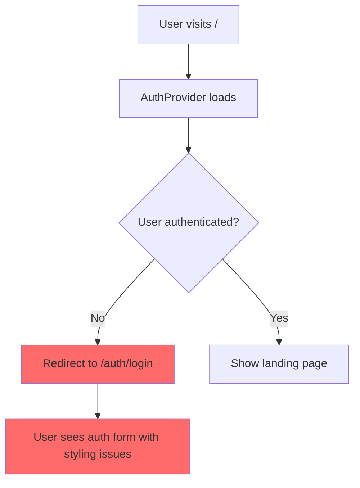
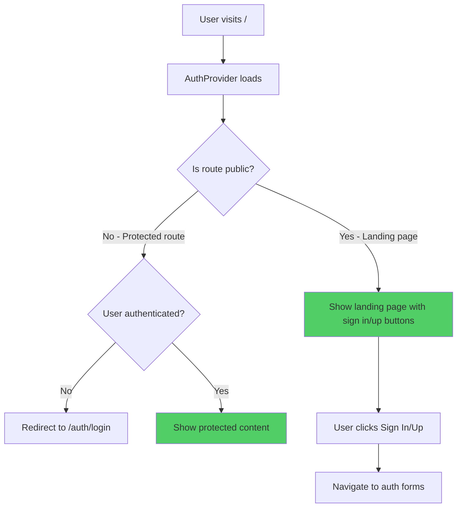
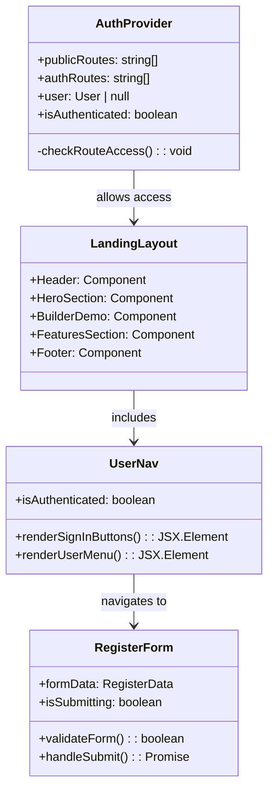
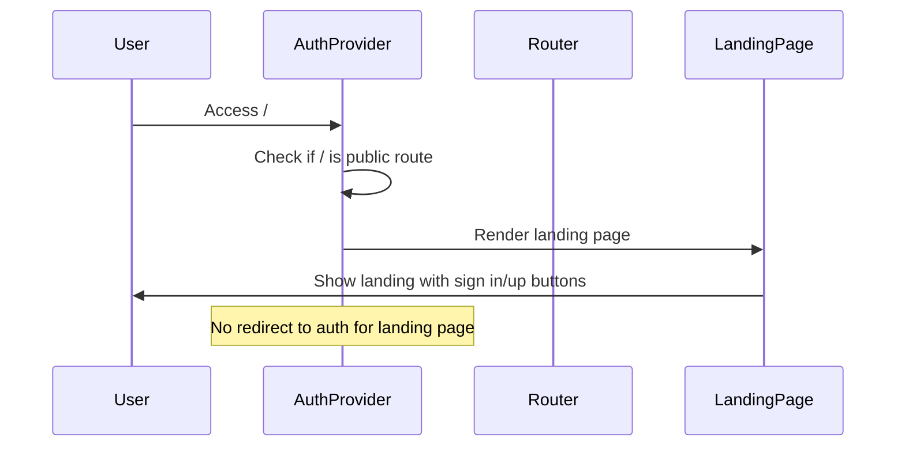
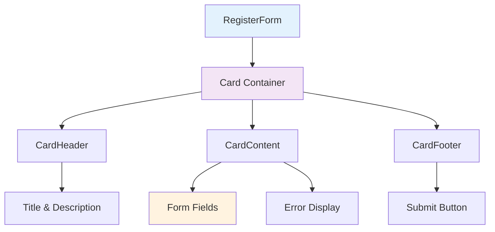
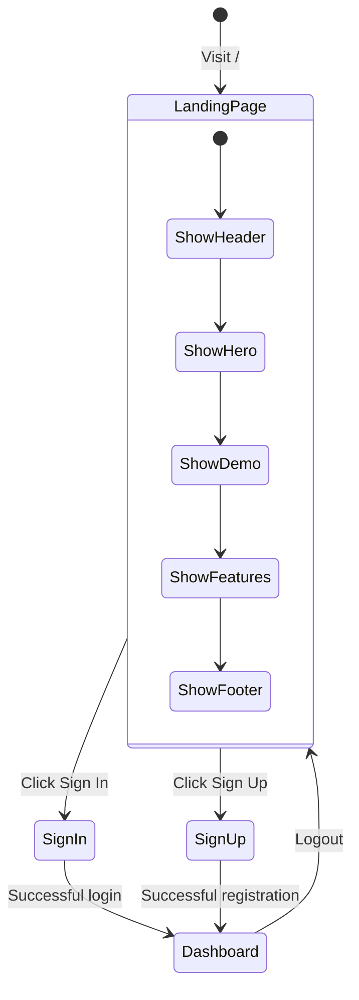
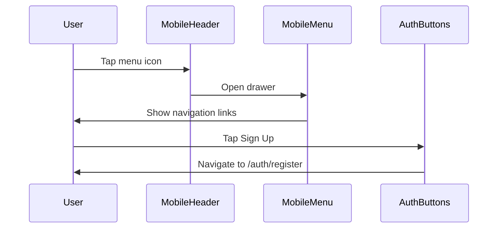
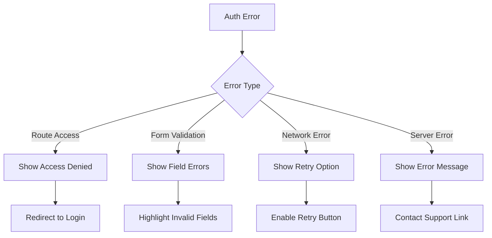

# Authentication Landing Page Redirect Fix

## Overview

This design addresses critical user experience issues in the AI Marketing Web Builder where:
1. Dev mode automatically redirects users to the authentication section instead of the landing page
2. Sign in/register buttons in the header are not properly styled
3. The registration form appears completely unstyled or styles are not loading correctly

## Problem Analysis

### Current Authentication Flow Issues



### Missing Landing Page Navigation

The current implementation lacks proper navigation in the landing page header. Users need:
- **Professional Header**: Fixed navigation bar with brand logo
- **Sign In Button**: Ghost variant with white text and yellow hover
- **Sign Up Button**: Outline variant with yellow border
- **Mobile Menu**: Responsive navigation for smaller screens
- **Navigation Links**: Platform, Features, Templates, Pricing sections

### Root Cause Analysis

1. **Over-Aggressive Authentication Guard**: The `AuthProvider` component redirects ALL unauthenticated users to `/auth/login`, including first-time visitors who should see the landing page
2. **Public Route Configuration**: The landing page (`/`) is not included in the `publicRoutes` array
3. **Missing Header Navigation**: The current `LandingLayout` lacks a proper header with sign in/register buttons
4. **Styling Dependencies**: Authentication forms may have missing Tailwind CSS classes or component dependencies
5. **Navigation Architecture**: No clear separation between authenticated and unauthenticated user experiences

## Architecture Design

### Updated Authentication Flow



### Component Architecture Updates



## Implementation Strategy

### Phase 1: Fix Authentication Route Logic

#### 1.1 Update Public Routes Configuration

**File**: `web-builder/src/components/auth/AuthProvider.tsx`

```typescript
// Routes that don't require authentication
const publicRoutes = [
  '/', // Landing page - CRITICAL ADDITION
  '/auth/login',
  '/auth/register',
  '/auth/forgot-password',
  '/auth/reset-password',
  '/templates', // Public template showcase
  '/pricing',   // Public pricing page
  '/about',     // Public about page
];
```

#### 1.2 Implement Smart Route Protection Logic



### Phase 2: Professional Landing Page Header Implementation

#### 2.1 Professional Header Design

Based on the provided mockup, implement a professional header with:

**Header Structure**:
```html
<header class="fixed top-0 w-full z-50 glass-morphism">
  <nav class="max-w-7xl mx-auto px-6 h-16 flex items-center justify-between">
    <Link href="/" class="text-white text-lg font-semibold hover:text-yellow-400">
      AI Marketing Pro
    </Link>
    
    <!-- Desktop Navigation -->
    <ul class="hidden md:flex items-center space-x-8">
      <li><a href="#platform">Platform</a></li>
      <li><a href="#features">Features</a></li>
      <li><a href="/templates">Templates</a></li>
      <li><a href="#pricing">Pricing</a></li>
    </ul>
    
    <!-- Auth Buttons -->
    <div class="hidden md:block">
      <UserNav />
    </div>
  </nav>
</header>
```

#### 2.2 UserNav Component Enhancement

**Current Issues**:
- Missing sign in/register buttons in landing page
- Buttons don't match professional dark theme
- No responsive mobile menu integration

**Design Solution**:

```mermaid
componentDiagram
    title Professional UserNav States
    
    component UnAuthenticatedState {
        Button[variant=ghost, text-white, hover-yellow] : Sign In
        Button[variant=outline, border-yellow-400, text-white] : Sign Up
    }
    
    component AuthenticatedState {
        Avatar[gradient-border] : User
        DropdownMenu[glass-morphism] : Profile Options
        Button[variant=ghost, text-white] : Sign Out
    }
    
    component MobileMenu {
        Button[mobile-toggle] : Menu Icon
        Drawer[full-width] : Navigation Links + Auth Buttons
    }
```

#### 2.3 Professional Button Styling

**Desktop Navigation Buttons**:
| Button | Style | Colors | Hover Effect |
|--------|-------|--------|--------------|
| Sign In | `variant="ghost"` | `text-white` | `hover:text-yellow-400` |
| Sign Up | `variant="outline"` | `text-white border-yellow-400` | `hover:bg-yellow-400 hover:text-black` |

**Mobile Menu Buttons**:
| Button | Style | Layout | Interaction |
|--------|-------|--------|-----------|
| Sign In | Full width ghost | `w-full justify-start` | Touch-friendly spacing |
| Sign Up | Full width primary | `w-full bg-yellow-400 text-black` | Prominent CTA placement |

**Glass Morphism Styling**:
```css
.header-glass {
  background: rgba(23, 23, 23, 0.8);
  backdrop-filter: blur(20px);
  border-bottom: 1px solid rgba(255, 255, 255, 0.1);
}
```

### Phase 3: Fix Registration Form Styling

#### 3.1 Component Dependencies Analysis

**Required UI Components**:
- `@/components/ui/button`
- `@/components/ui/input`
- `@/components/ui/card`
- `@/components/ui/label`
- `@/components/ui/checkbox`

#### 3.2 Styling Architecture



#### 3.3 Layout Structure Design

```typescript
interface FormLayoutStructure {
  container: "min-h-screen flex items-center justify-center bg-gray-50";
  wrapper: "w-full max-w-md space-y-8";
  card: "shadow-lg border-0";
  formFields: "space-y-4";
  buttonGrid: "grid grid-cols-2 gap-4";
  submitButton: "w-full";
}
```

## Design Specifications

### Landing Page Access Flow



### Professional Component Specifications

#### Landing Page Header Navigation
```css
.professional-header {
  position: fixed;
  top: 0;
  width: 100%;
  z-index: 50;
  background: rgba(23, 23, 23, 0.8);
  backdrop-filter: blur(20px);
  border-bottom: 1px solid rgba(255, 255, 255, 0.1);
  transition: all 0.3s ease;
}

.header-scrolled {
  background: rgba(0, 0, 0, 0.9);
  border-bottom: 1px solid rgba(250, 204, 21, 0.2);
}

.nav-link {
  color: rgb(209, 213, 219); /* text-gray-300 */
  font-size: 0.875rem;
  transition: color 0.2s ease;
}

.nav-link:hover {
  color: rgb(255, 255, 255);
}

.nav-link.active {
  color: rgb(250, 204, 21); /* text-yellow-400 */
}
```

#### Professional Auth Buttons
```css
.btn-sign-in {
  background: transparent;
  color: white;
  font-weight: 600;
  padding: 0.5rem 1rem;
  border-radius: 0.5rem;
  border: none;
  transition: all 0.2s ease;
}

.btn-sign-in:hover {
  color: rgb(250, 204, 21);
  background: rgba(250, 204, 21, 0.1);
}

.btn-sign-up {
  background: transparent;
  color: white;
  font-weight: 600;
  padding: 0.5rem 1rem;
  border-radius: 0.5rem;
  border: 2px solid rgb(250, 204, 21);
  transition: all 0.2s ease;
}

.btn-sign-up:hover {
  background: rgb(250, 204, 21);
  color: black;
  transform: translateY(-2px);
  box-shadow: 0 8px 16px -4px rgba(250, 204, 21, 0.4);
}
```

### Mobile Responsive Design

#### Mobile Header Implementation


**Mobile Breakpoints**:
- `sm`: 640px - Show condensed header
- `md`: 768px - Show full desktop navigation  
- `lg`: 1024px - Full professional layout
- `xl`: 1280px - Maximum width container

**Mobile Menu Features**:
- Slide-out drawer with glass morphism background
- Touch-friendly button spacing (44px minimum)
- Smooth animations using CSS transforms
- Backdrop blur for iOS compatibility

### Form Styling Requirements

#### Color Scheme
| Element | Light Mode | Dark Mode |
|---------|------------|-----------|
| Background | `bg-gray-50` | `bg-gray-900` |
| Card | `bg-white` | `bg-gray-800` |
| Text | `text-gray-900` | `text-gray-100` |
| Inputs | `bg-white border-gray-300` | `bg-gray-700 border-gray-600` |
| Buttons | `bg-blue-600` | `bg-blue-500` |

#### Typography Scale
```css
.form-title {
  font-size: text-3xl;
  font-weight: font-bold;
  line-height: tracking-tight;
}

.form-subtitle {
  font-size: text-sm;
  color: text-gray-600;
}

.field-label {
  font-size: text-sm;
  font-weight: font-medium;
}
```

### Implementation Checklist

#### Phase 1: Authentication Route Fix
- [ ] Update `publicRoutes` array in `AuthProvider.tsx`
- [ ] Add `/` to public routes list
- [ ] Add `/templates`, `/pricing`, `/about` to public routes
- [ ] Test route protection logic
- [ ] Verify landing page accessibility

#### Phase 2: Professional Header Implementation
- [ ] Create `ProfessionalHeader` component
- [ ] Implement glass morphism styling
- [ ] Add scroll-based header transitions
- [ ] Integrate navigation links with smooth scrolling
- [ ] Add mobile responsive menu

#### Phase 3: UserNav Enhancement
- [ ] Update button styling to match mockup
- [ ] Implement proper color scheme
- [ ] Add hover animations and effects
- [ ] Test authentication state changes
- [ ] Verify mobile responsiveness

#### Phase 4: Form Styling Fix
- [ ] Audit UI component dependencies
- [ ] Verify Tailwind CSS compilation
- [ ] Test form rendering across browsers
- [ ] Implement proper error states
- [ ] Add loading animations

#### Test Cases

| Test ID | Scenario | Expected Result |
|---------|----------|-----------------|
| AUTH-001 | Visit `/` without authentication | Show landing page, not redirect to auth |
| AUTH-002 | Click Sign In button | Navigate to styled login form |
| AUTH-003 | Click Sign Up button | Navigate to styled registration form |
| AUTH-004 | Complete registration | Redirect to dashboard |
| AUTH-005 | Access protected route while logged out | Redirect to login |
| AUTH-006 | Access auth pages while logged in | Redirect to dashboard |

### Styling Validation Tests

| Component | Test | Validation |
|-----------|------|------------|
| UserNav | Button visibility | Sign In/Up buttons visible when not authenticated |
| UserNav | Button styling | Proper ghost/outline variants applied |
| RegisterForm | Form layout | Card layout with proper spacing |
| RegisterForm | Input styling | Consistent input field appearance |
| RegisterForm | Button state | Submit button shows loading state |

## Unified Super Luxurious Brand Theme

### Theme Integration Strategy

Merging existing landing components with professional mockup to create a unified luxury experience:

**Existing Assets to Enhance:**
- Header.tsx: Add glass morphism and luxury gold accents
- HeroSection.tsx: Integrate luxury animations and premium styling
- BuilderDemo.tsx: Enhance with glass effects and premium interactions
- FeaturesSection.tsx: Add luxury card styling and enhanced animations
- Footer.tsx: Apply glass morphism and premium newsletter section

### Luxury Design System

#### Color Palette
```scss
--luxury-gold: #FFD700;
--luxury-gold-light: #FFF700;
--luxury-black: #0A0A0A;
--glass-bg: rgba(255, 255, 255, 0.08);
--glass-border: rgba(255, 255, 255, 0.12);
```

#### Typography
```scss
--font-hero: 4.5rem;    // Luxury hero text
--font-h1: 3.5rem;      // Section headers
--weight-black: 900;    // Premium weight
```

### Enhanced Component Specifications

#### Luxury Header Component
```tsx
// Luxury header with glass morphism
<motion.header className="fixed top-0 w-full z-50 bg-black/90 backdrop-blur-xl border-b border-gold/20">
  <nav className="max-w-7xl mx-auto px-6 h-20 flex items-center justify-between">
    {/* Luxury Logo */}
    <motion.div className="flex items-center space-x-3" whileHover={{ scale: 1.05 }}>
      <div className="w-12 h-12 bg-gradient-to-br from-luxury-gold to-luxury-gold-light rounded-xl flex items-center justify-center shadow-lg">
        <span className="text-black font-black text-xl">AI</span>
      </div>
      <span className="text-white text-xl font-bold">Marketing Pro</span>
    </motion.div>
    
    {/* Enhanced Auth Buttons */}
    <div className="flex items-center space-x-4">
      <motion.button className="text-gray-300 hover:text-luxury-gold transition-all" whileHover={{ scale: 1.05 }}>
        Sign In
      </motion.button>
      <motion.button className="bg-gradient-to-r from-luxury-gold to-luxury-gold-light text-black px-6 py-2.5 rounded-xl font-semibold hover:shadow-2xl hover:shadow-luxury-gold/30" whileHover={{ scale: 1.05, y: -2 }}>
        Get Started
      </motion.button>
    </div>
  </nav>
</motion.header>
```

#### Luxury Hero Section Enhancement
```tsx
// Enhanced hero with luxury styling
<section className="relative min-h-screen flex items-center justify-center overflow-hidden">
  {/* Luxury Background Effects */}
  <div className="absolute inset-0 bg-gradient-to-br from-luxury-black via-gray-900 to-luxury-black" />
  <div className="absolute top-1/4 left-1/4 w-96 h-96 bg-luxury-gold/5 rounded-full blur-3xl" />
  
  {/* Floating Glass Elements */}
  <motion.div className="absolute top-20 right-20 w-32 h-32 bg-glass-bg backdrop-blur-xl border border-glass-border rounded-2xl" animate={{ y: [-20, 20, -20] }} transition={{ duration: 6, repeat: Infinity }} />
  
  <motion.div className="relative z-10 text-center max-w-6xl mx-auto">
    {/* Luxury Title */}
    <h1 className="text-6xl md:text-8xl font-black text-white leading-tight mb-4">
      Build{' '}
      <span className="text-transparent bg-clip-text bg-gradient-to-r from-luxury-gold via-luxury-gold-light to-luxury-gold-dark">
        Intelligent
      </span>
      <br />Marketing Systems
    </h1>
    
    {/* Enhanced CTA Buttons */}
    <div className="flex flex-col sm:flex-row gap-6 justify-center items-center">
      <motion.button className="bg-gradient-to-r from-luxury-gold to-luxury-gold-light text-black px-10 py-5 rounded-2xl font-bold text-lg hover:shadow-2xl hover:shadow-luxury-gold/40" whileHover={{ scale: 1.05, y: -3 }}>
        Start Building Free
      </motion.button>
      <motion.button className="border-2 border-glass-border bg-glass-bg backdrop-blur-xl text-white px-10 py-5 rounded-2xl font-semibold hover:border-luxury-gold/50" whileHover={{ scale: 1.05, y: -3 }}>
        Watch Demo
      </motion.button>
    </div>
  </motion.div>
</section>
```

### Component Enhancement Checklist

#### Header.tsx Updates
- [ ] Add glass morphism background with `backdrop-blur-xl`
- [ ] Enhance logo with gradient gold styling
- [ ] Implement luxury button animations
- [ ] Add gold accent hover states

#### HeroSection.tsx Updates
- [ ] Increase font sizes for luxury scale
- [ ] Add floating glass elements
- [ ] Enhance gradient text effects
- [ ] Implement premium button styling

#### BuilderDemo.tsx Updates
- [ ] Apply glass morphism to demo container
- [ ] Add luxury gold accent colors
- [ ] Enhance tab styling with gradients
- [ ] Implement premium hover effects

#### FeaturesSection.tsx Updates
- [ ] Add glass morphism to feature cards
- [ ] Implement luxury hover animations
- [ ] Apply gold accent colors to icons
- [ ] Enhance typography for premium feel

### 2.6 Comprehensive Component Theming

#### Dashboard Components Luxury Upgrade

**UserDashboard.tsx Enhancement**
```tsx
// Luxury dashboard with glass morphism and premium styling
<div className="min-h-screen bg-gradient-to-br from-luxury-black via-gray-900 to-luxury-black">
  {/* Luxury Header */}
  <header className="bg-glass-bg backdrop-blur-xl border-b border-luxury-gold/20 shadow-2xl">
    <div className="max-w-7xl mx-auto px-6">
      <div className="flex justify-between items-center h-20">
        <motion.div className="flex items-center space-x-4" initial={{ x: -20, opacity: 0 }} animate={{ x: 0, opacity: 1 }}>
          <div className="w-10 h-10 bg-gradient-to-br from-luxury-gold to-luxury-gold-light rounded-xl flex items-center justify-center shadow-lg">
            <span className="text-black font-black text-lg">AI</span>
          </div>
          <h1 className="text-2xl font-black text-text-primary">Dashboard</h1>
          <div className="w-px h-6 bg-luxury-gold/30" />
          <span className="text-text-secondary font-medium">Welcome back, {user?.first_name}!</span>
        </motion.div>
        
        <div className="flex items-center space-x-4">
          <motion.button className="bg-gradient-to-r from-luxury-gold to-luxury-gold-light text-black px-6 py-2.5 rounded-xl font-semibold hover:shadow-2xl hover:shadow-luxury-gold/30" whileHover={{ scale: 1.05, y: -2 }}>
            New Project
          </motion.button>
          <UserNav />
        </div>
      </div>
    </div>
  </header>
  
  {/* Stats Grid with Glass Morphism */}
  <div className="max-w-7xl mx-auto px-6 py-8">
    <div className="grid grid-cols-1 md:grid-cols-4 gap-6 mb-8">
      {statsCards.map((stat, index) => (
        <motion.div key={stat.title} className="bg-glass-bg backdrop-blur-xl border border-glass-border rounded-2xl p-6 hover:border-luxury-gold/30 transition-all duration-300" initial={{ y: 20, opacity: 0 }} animate={{ y: 0, opacity: 1 }} transition={{ delay: index * 0.1 }}>
          <div className="flex items-center justify-between mb-4">
            <div className={`w-12 h-12 ${stat.iconBg} rounded-xl flex items-center justify-center`}>
              <stat.icon size={24} className="text-white" />
            </div>
            <span className="text-xs font-medium text-luxury-gold bg-luxury-gold/10 px-2 py-1 rounded-full">
              +{stat.change}%
            </span>
          </div>
          <h3 className="text-2xl font-black text-text-primary mb-1">{stat.value}</h3>
          <p className="text-text-secondary text-sm">{stat.title}</p>
        </motion.div>
      ))}
    </div>
  </div>
</div>
```

#### Auth Forms Luxury Enhancement

**LoginForm.tsx Luxury Redesign**
```tsx
// Luxury login form with glass morphism and premium animations
<div className="min-h-screen bg-gradient-to-br from-luxury-black via-gray-900 to-luxury-black flex items-center justify-center px-6 relative overflow-hidden">
  {/* Background Effects */}
  <div className="absolute top-1/4 left-1/4 w-96 h-96 bg-luxury-gold/3 rounded-full blur-3xl" />
  <div className="absolute bottom-1/4 right-1/4 w-64 h-64 bg-luxury-gold/5 rounded-full blur-2xl" />
  
  {/* Floating Glass Elements */}
  <motion.div className="absolute top-20 right-20 w-24 h-24 bg-glass-bg backdrop-blur-xl border border-glass-border rounded-xl" animate={{ y: [-10, 10, -10], rotate: [0, 5, 0] }} transition={{ duration: 6, repeat: Infinity }} />
  
  <motion.div className="relative z-10 w-full max-w-md" initial={{ scale: 0.9, opacity: 0 }} animate={{ scale: 1, opacity: 1 }} transition={{ duration: 0.6 }}>
    {/* Luxury Header */}
    <div className="text-center mb-8">
      <motion.div className="flex items-center justify-center mb-6" initial={{ y: -20 }} animate={{ y: 0 }} transition={{ delay: 0.2 }}>
        <div className="w-16 h-16 bg-gradient-to-br from-luxury-gold to-luxury-gold-light rounded-2xl flex items-center justify-center shadow-2xl shadow-luxury-gold/30">
          <span className="text-black font-black text-2xl">AI</span>
        </div>
      </motion.div>
      <h1 className="text-3xl font-black text-text-primary mb-3">Welcome Back</h1>
      <p className="text-text-secondary">
        New to AI Marketing Pro?{' '}
        <Link href="/auth/register" className="text-luxury-gold hover:text-luxury-gold-light font-semibold transition-colors">
          Create Account
        </Link>
      </p>
    </div>
    
    {/* Luxury Form Card */}
    <motion.div className="bg-glass-bg backdrop-blur-xl border border-glass-border rounded-2xl p-8 shadow-2xl" initial={{ y: 20 }} animate={{ y: 0 }} transition={{ delay: 0.3 }}>
      <form onSubmit={handleSubmit} className="space-y-6">
        {error && (
          <motion.div className="bg-red-500/10 border border-red-500/20 text-red-400 rounded-xl p-4 text-sm" initial={{ opacity: 0, scale: 0.95 }} animate={{ opacity: 1, scale: 1 }}>
            {error}
          </motion.div>
        )}
        
        <div className="space-y-2">
          <Label className="text-text-secondary font-medium">Email Address</Label>
          <Input className="bg-luxury-gray-800/50 border-glass-border text-text-primary placeholder-text-muted rounded-xl px-4 py-3 focus:border-luxury-gold/50 focus:ring-2 focus:ring-luxury-gold/20 transition-all" placeholder="Enter your email" />
        </div>
        
        <div className="space-y-2">
          <Label className="text-text-secondary font-medium">Password</Label>
          <Input type="password" className="bg-luxury-gray-800/50 border-glass-border text-text-primary placeholder-text-muted rounded-xl px-4 py-3 focus:border-luxury-gold/50 focus:ring-2 focus:ring-luxury-gold/20 transition-all" placeholder="Enter your password" />
        </div>
        
        <div className="flex items-center justify-between">
          <div className="flex items-center space-x-2">
            <Checkbox className="border-glass-border data-[state=checked]:bg-luxury-gold data-[state=checked]:border-luxury-gold" />
            <span className="text-text-secondary text-sm">Remember me</span>
          </div>
          <Link href="/auth/forgot-password" className="text-luxury-gold hover:text-luxury-gold-light text-sm font-medium transition-colors">
            Forgot Password?
          </Link>
        </div>
        
        <motion.button type="submit" className="w-full bg-gradient-to-r from-luxury-gold to-luxury-gold-light text-black font-bold py-4 rounded-xl hover:shadow-2xl hover:shadow-luxury-gold/40 transition-all duration-300" whileHover={{ scale: 1.02, y: -2 }} whileTap={{ scale: 0.98 }} disabled={isSubmitting}>
          {isSubmitting ? 'Signing In...' : 'Sign In'}
        </motion.button>
      </form>
    </motion.div>
  </motion.div>
</div>
```

**RegisterForm.tsx Luxury Enhancement**
```tsx
// Luxury registration form with enhanced styling
<div className="min-h-screen bg-gradient-to-br from-luxury-black via-gray-900 to-luxury-black flex items-center justify-center px-6 py-12 relative overflow-hidden">
  {/* Background Effects */}
  <div className="absolute top-0 left-1/2 w-96 h-1 bg-gradient-to-r from-transparent via-luxury-gold to-transparent" />
  <div className="absolute inset-0 bg-[radial-gradient(circle_at_50%_50%,rgba(255,215,0,0.03),transparent_50%)]" />
  
  <motion.div className="relative z-10 w-full max-w-lg" initial={{ scale: 0.95, opacity: 0 }} animate={{ scale: 1, opacity: 1 }} transition={{ duration: 0.7 }}>
    {/* Luxury Header */}
    <div className="text-center mb-8">
      <motion.div className="flex items-center justify-center mb-6">
        <div className="relative">
          <div className="w-16 h-16 bg-gradient-to-br from-luxury-gold via-luxury-gold-light to-luxury-gold-dark rounded-2xl flex items-center justify-center shadow-2xl">
            <span className="text-black font-black text-2xl">AI</span>
          </div>
          <div className="absolute -inset-2 bg-gradient-to-br from-luxury-gold/30 to-transparent rounded-2xl blur-lg opacity-75" />
        </div>
      </motion.div>
      <h1 className="text-3xl font-black text-text-primary mb-3">Join AI Marketing Pro</h1>
      <p className="text-text-secondary">
        Already have an account?{' '}
        <Link href="/auth/login" className="text-luxury-gold hover:text-luxury-gold-light font-semibold transition-colors">
          Sign In
        </Link>
      </p>
    </div>
    
    {/* Luxury Form Card */}
    <motion.div className="bg-glass-bg backdrop-blur-xl border border-glass-border rounded-3xl p-8 shadow-2xl">
      <form className="space-y-6">
        {/* Name Fields Grid */}
        <div className="grid grid-cols-2 gap-4">
          <div className="space-y-2">
            <Label className="text-text-secondary font-medium">First Name</Label>
            <Input className="bg-luxury-gray-800/50 border-glass-border text-text-primary rounded-xl px-4 py-3 focus:border-luxury-gold/50 focus:ring-2 focus:ring-luxury-gold/20" />
          </div>
          <div className="space-y-2">
            <Label className="text-text-secondary font-medium">Last Name</Label>
            <Input className="bg-luxury-gray-800/50 border-glass-border text-text-primary rounded-xl px-4 py-3 focus:border-luxury-gold/50 focus:ring-2 focus:ring-luxury-gold/20" />
          </div>
        </div>
        
        <div className="space-y-2">
          <Label className="text-text-secondary font-medium">Email Address</Label>
          <Input type="email" className="bg-luxury-gray-800/50 border-glass-border text-text-primary rounded-xl px-4 py-3 focus:border-luxury-gold/50 focus:ring-2 focus:ring-luxury-gold/20" />
        </div>
        
        <div className="space-y-2">
          <Label className="text-text-secondary font-medium">Password</Label>
          <Input type="password" className="bg-luxury-gray-800/50 border-glass-border text-text-primary rounded-xl px-4 py-3 focus:border-luxury-gold/50 focus:ring-2 focus:ring-luxury-gold/20" />
        </div>
        
        <div className="space-y-2">
          <Label className="text-text-secondary font-medium">Confirm Password</Label>
          <Input type="password" className="bg-luxury-gray-800/50 border-glass-border text-text-primary rounded-xl px-4 py-3 focus:border-luxury-gold/50 focus:ring-2 focus:ring-luxury-gold/20" />
        </div>
        
        <div className="flex items-start space-x-3">
          <Checkbox className="mt-1 border-glass-border data-[state=checked]:bg-luxury-gold data-[state=checked]:border-luxury-gold" />
          <span className="text-text-secondary text-sm leading-relaxed">
            I agree to the{' '}
            <Link href="/terms" className="text-luxury-gold hover:text-luxury-gold-light font-medium">
              Terms & Conditions
            </Link>{' '}
            and{' '}
            <Link href="/privacy" className="text-luxury-gold hover:text-luxury-gold-light font-medium">
              Privacy Policy
            </Link>
          </span>
        </div>
        
        <motion.button type="submit" className="w-full bg-gradient-to-r from-luxury-gold to-luxury-gold-light text-black font-bold py-4 rounded-xl hover:shadow-2xl hover:shadow-luxury-gold/40 transition-all duration-300" whileHover={{ scale: 1.02, y: -2 }}>
          Create Account
        </motion.button>
      </form>
    </motion.div>
  </motion.div>
</div>
```

#### UserNav Component Luxury Update
```tsx
// Enhanced UserNav with luxury styling
export function LuxuryUserNav() {
  if (!isAuthenticated || !user) {
    return (
      <div className="flex items-center space-x-3">
        <motion.button className="text-text-secondary hover:text-luxury-gold font-medium transition-all duration-300" whileHover={{ scale: 1.05 }} onClick={() => router.push('/auth/login')}>
          Sign In
        </motion.button>
        <motion.button className="bg-gradient-to-r from-luxury-gold to-luxury-gold-light text-black px-6 py-2.5 rounded-xl font-semibold hover:shadow-2xl hover:shadow-luxury-gold/30 transition-all duration-300" whileHover={{ scale: 1.05, y: -2 }} onClick={() => router.push('/auth/register')}>
          Get Started
        </motion.button>
      </div>
    );
  }
  
  return (
    <div className="flex items-center space-x-4">
      <div className="bg-glass-bg backdrop-blur-md border border-glass-border rounded-xl px-4 py-2">
        <span className="text-text-secondary text-sm">
          Welcome, <span className="text-luxury-gold font-semibold">{user.first_name}</span>
        </span>
      </div>
      <motion.button className="border border-glass-border hover:border-luxury-gold/50 text-text-secondary hover:text-luxury-gold px-4 py-2 rounded-xl transition-all duration-300" whileHover={{ scale: 1.05 }} onClick={handleLogout}>
        Sign Out
      </motion.button>
    </div>
  );
}
```

#### Builder Components Luxury Enhancement

**Canvas Interface Luxury Styling**
```tsx
// Luxury builder canvas with glass morphism toolbar
<div className="min-h-screen bg-gradient-to-br from-luxury-black via-gray-900 to-luxury-black">
  {/* Luxury Toolbar */}
  <div className="bg-glass-bg backdrop-blur-xl border-b border-glass-border">
    <div className="flex items-center justify-between px-6 py-4">
      <div className="flex items-center space-x-4">
        <div className="w-10 h-10 bg-gradient-to-br from-luxury-gold to-luxury-gold-light rounded-xl flex items-center justify-center">
          <span className="text-black font-black text-lg">AI</span>
        </div>
        <div className="h-6 w-px bg-glass-border" />
        <div className="flex items-center space-x-2">
          <motion.button className="bg-glass-bg border border-glass-border hover:border-luxury-gold/50 text-text-secondary hover:text-luxury-gold p-2 rounded-lg transition-all" whileHover={{ scale: 1.05 }}>
            <Save size={18} />
          </motion.button>
        </div>
      </div>
      
      <div className="flex items-center space-x-3">
        <motion.button className="bg-gradient-to-r from-luxury-gold to-luxury-gold-light text-black px-6 py-2.5 rounded-xl font-semibold hover:shadow-2xl hover:shadow-luxury-gold/30" whileHover={{ scale: 1.05, y: -2 }}>
          Publish
        </motion.button>
      </div>
    </div>
  </div>
</div>
```

**Analytics Dashboard Luxury Theming**
```tsx
// Luxury analytics dashboard with glass morphism cards
<div className="space-y-8">
  <div className="flex items-center justify-between">
    <div>
      <h1 className="text-3xl font-black text-text-primary mb-2">Analytics Dashboard</h1>
      <p className="text-text-secondary">Real-time insights and performance metrics</p>
    </div>
  </div>
  
  <div className="grid grid-cols-1 md:grid-cols-4 gap-6">
    {metricsData.map((metric, index) => (
      <motion.div key={metric.title} className="bg-glass-bg backdrop-blur-xl border border-glass-border rounded-2xl p-6 hover:border-luxury-gold/30 transition-all duration-300">
        <div className="flex items-center justify-between mb-4">
          <div className={`w-12 h-12 ${metric.iconBg} rounded-xl flex items-center justify-center`}>
            <metric.icon size={24} className="text-white" />
          </div>
        </div>
        <h3 className="text-2xl font-black text-text-primary mb-1">{metric.value}</h3>
        <p className="text-text-secondary text-sm">{metric.title}</p>
      </motion.div>
    ))}
  </div>
</div>
```

### 2.7 Universal Component Theming Guidelines

#### Global CSS Variables
```css
:root {
  --luxury-gold: #FFD700;
  --luxury-gold-light: #FFF700;
  --glass-bg: rgba(255, 255, 255, 0.08);
  --glass-border: rgba(255, 255, 255, 0.12);
  --text-primary: #FFFFFF;
  --text-secondary: #E5E5E5;
}
```

#### Component Class System
```css
.btn-luxury-primary {
  @apply bg-gradient-to-r from-luxury-gold to-luxury-gold-light text-black font-bold px-6 py-3 rounded-xl hover:shadow-2xl transition-all duration-300;
}

.card-glass {
  @apply bg-glass-bg backdrop-blur-xl border border-glass-border rounded-2xl;
}

.input-luxury {
  @apply bg-luxury-gray-800/50 border-glass-border text-text-primary rounded-xl px-4 py-3 focus:border-luxury-gold/50 transition-all;
}
```

### 2.8 Implementation Checklist - All Components

#### Landing Page Components
- [ ] Header.tsx: Glass morphism header with luxury logo
- [ ] HeroSection.tsx: Premium animations and floating elements
- [ ] BuilderDemo.tsx: Luxury demo container with enhanced interactions
- [ ] FeaturesSection.tsx: Glass cards with luxury hover effects
- [ ] Footer.tsx: Premium newsletter and social icons

#### Authentication Components
- [ ] LoginForm.tsx: Luxury form with glass morphism background
- [ ] RegisterForm.tsx: Enhanced multi-step luxury styling
- [ ] UserNav.tsx: Premium button styling and animations
- [ ] AuthProvider.tsx: Updated for luxury theme support

#### Dashboard Components
- [ ] UserDashboard.tsx: Glass morphism stats cards and header
- [ ] Analytics components: Luxury charts and metrics
- [ ] Navigation: Premium sidebar and top navigation
- [ ] Project cards: Glass morphism project thumbnails

#### Builder Components
- [ ] Canvas interface: Glass toolbar and luxury controls
- [ ] Component sidebar: Premium drag-and-drop styling
- [ ] Properties panel: Luxury form controls and inputs
- [ ] Preview mode: Enhanced luxury preview styling

## Performance Considerations

### Component Loading Strategy

```mermaid
gantt
    title Component Loading Timeline
    dateFormat X
    axisFormat %s
    
    section Initial Load
    AuthProvider    :0, 100
    Landing Page    :50, 200
    Header Components :100, 150
    
    section User Interaction
    Sign In Click   :200, 250
    Auth Form Load  :220, 300
    Form Styling    :240, 280
```



### Bundle Size Optimization
- Lazy load authentication forms
- Code split auth components
- Optimize UI component imports

## Error Handling

### Authentication Error Flow



### Fallback Strategies
- Default to landing page on routing errors
- Graceful degradation for styling failures
- Offline mode handling for authentication

## Success Metrics

### User Experience Metrics
- **Landing Page Access**: 100% of users see landing page on first visit
- **Button Interaction**: <200ms response time for sign in/up clicks
- **Form Completion**: <5 seconds to complete registration form
- **Styling Consistency**: 0 unstyled form elements

### Technical Metrics
- **Route Resolution**: <50ms for route access checks
- **Component Rendering**: <100ms for auth form display
- **Error Recovery**: <1 second to recover from auth errors