# Commit and Pull Request Workflow Design

## Overview

This document defines the standardized commit and pull request workflow for the AI Marketing Web Builder project, integrating with the existing Archon MCP server and BMad protocol. The workflow ensures code quality, maintains stability of the main branch, and facilitates effective collaboration between team members by leveraging Archon task management, GitHub MCP automation, and the established BMad development phases.

## Technology Stack & Dependencies

**Archon Integration:**
- Archon MCP Server for task management and knowledge base
- Task-driven development with Archon workflow cycles
- Archon RAG queries for research and implementation guidance
- Automatic task status updates and PR linking

**Git Workflow Tools:**
- Git with conventional commit standards
- GitHub MCP Server for automated repository management
- GitHub for repository hosting and PR management
- Pre-commit hooks with automated validation
- Branch protection rules on main branch

**Quality Assurance Tools:**
- Pre-commit: Code quality validation before commits
- ESLint/TypeScript: Frontend code quality
- Flake8/MyPy: Backend code quality
- Playwright MCP: End-to-end testing automation
- Jest: Unit testing

**BMad Protocol Integration:**
- 6-phase development lifecycle
- E2E validation with Playwright MCP
- PR review categorization system
- Parallel agent coordination

## Architecture

### Archon-Driven Workflow State Machine


### BMad Integration Architecture

```mermaid
graph LR
    A[📝 Story Created] --> B[🔧 In Development]
    B --> C[✅ QA Testing]
    C --> D[🎭 E2E Validation]
    D --> E[🚀 Deployed]
    E --> F[🎯 Complete]
    
    B --> G[Archon Task Doing]
    C --> H[Archon Task Review]
    D --> I[Playwright MCP Testing]
    E --> J[GitHub MCP Merge]
    F --> K[Archon Task Complete]
```



## Component Definition

### 1. Archon MCP Integration Component

**Purpose:** Manage task lifecycle and provide research capabilities

**Core Archon Workflow:**
```bash
# 1. Check Current Task Status
archon:manage_task(
  action="list",
  filter_by="status",
  filter_value="todo",
  project_id="ai-marketing-web-builder"
)

# 2. Get Specific Task Details
archon:manage_task(
  action="get",
  task_id="task-123"
)

# 3. Research Before Implementation
archon:perform_rag_query(
  query="React component testing best practices",
  match_count=5
)

archon:search_code_examples(
  query="Next.js API route implementation",
  match_count=3
)

# 4. Update Task to In Progress
archon:manage_task(
  action="update",
  task_id="task-123",
  update_fields={"status": "doing"}
)

# 5. Complete and Move to Review
archon:manage_task(
  action="update",
  task_id="task-123",
  update_fields={
    "status": "review",
    "pr_url": "https://github.com/gpb360/AI-Marketing-Web-Builder/pull/134"
  }
)
```

**Research Integration:**
- High-level patterns: Architecture, security, optimization
- Low-level implementation: API usage, syntax, configuration
- Code examples: Specific implementations and patterns
- Debugging guidance: Error resolution and troubleshooting

### 2. GitHub MCP Server Component

**Purpose:** Automate GitHub repository operations following BMad protocol

**Critical Rule:** **NEVER USE GITHUB API DIRECTLY - ALWAYS USE GITHUB MCP TOOLS**

```bash
# ❌ WRONG - Will always fail with 401 errors
GET https://api.github.com/repos/...

# ✅ CORRECT - Use GitHub MCP tools exclusively
mcp__github__list_pull_requests(owner="gpb360", repo="AI-Marketing-Web-Builder")
mcp__github__create_pull_request(...)
mcp__github__get_pull_request(...)
```

**Available MCP Commands:**
- `mcp__github__list_pull_requests(owner, repo, state)`: List pull requests
- `mcp__github__get_pull_request(owner, repo, pullNumber)`: Get PR details
- `mcp__github__create_pull_request(owner, repo, title, head, base, body)`: Create new PR
- `mcp__github__merge_pull_request(owner, repo, pullNumber)`: Merge approved PR

### 3. BMad Review Categorization Component

**Purpose:** Standardize PR review process with mandatory categorization

**Five Required Categories:**

1. **Nice to Have Future Development**
   - Action: Document in backlog for future sprints
   - Decision: Approve PR, create future tasks

2. **Must Haves Future Add-ons**
   - Action: Create high-priority Archon tasks immediately
   - Decision: Approve PR, schedule high-priority follow-up

3. **Current Blocker Fix Now**
   - Action: DO NOT MERGE - Fix in current branch immediately
   - Decision: Request changes, block merge until fixed

4. **Not Needed Move On**
   - Action: Document reasoning and proceed with merge
   - Decision: Approve PR, document why suggestions were declined

5. **Should Be Refactored - Technical Debt**
   - Action: Approve merge but create refactoring task
   - Decision: Merge now, add to technical debt backlog

### 4. Playwright MCP E2E Validation Component

**Purpose:** Automated end-to-end testing for Phase 4 validation

**E2E Test Categories:**
```bash
# 1. Magic Moment Validation (<30 minutes template-to-live-site)
mcp__playwright__browser_navigate(url="http://localhost:3003")
mcp__playwright__browser_click(element="Templates link")
mcp__playwright__browser_wait_for(text="Premium Templates")
mcp__playwright__browser_click(element="SaaS Pro template")
mcp__playwright__browser_wait_for(text="Site published successfully", time=30)

# 2. Cross-Browser Testing (Chrome, Firefox, Safari)
# 3. Component Intelligence Testing (<5 seconds AI response)
# 4. Performance Benchmarking (<3 seconds template loading)
```

## Workflow Procedures

### Pre-Work Protocol (Mandatory Sequence)

**RULE: Execute in this exact order before any work starts:**

```bash
# 1. Check Current Branch Status
git status
git log --oneline -5

# 2. Process Review Column Tasks from Archon
archon:manage_task(
  action="list",
  filter_by="status",
  filter_value="review"
)

# 3. Verify Review Tasks Have PRs
# REQUIREMENT: Every Review task MUST have corresponding PR
mcp__github__list_pull_requests(
  owner="gpb360",
  repo="AI-Marketing-Web-Builder",
  state="open"
)

# 4. Create New Branch from Main
git checkout main
git pull origin main
git checkout -b feature/task-{archon-id}-{description}
git push -u origin feature/task-{archon-id}-{description}

# 5. Only Then Begin New Task Work
```

### Archon Task-Driven Development Workflow

```bash
# 1. Get Next Priority Task
archon:manage_task(
  action="list",
  filter_by="status",
  filter_value="todo",
  project_id="ai-marketing-web-builder"
)

# 2. Research Phase (Mandatory)
# High-level architecture and patterns
archon:perform_rag_query(
  query="React component architecture patterns",
  match_count=5
)

# Specific implementation guidance
archon:search_code_examples(
  query="Next.js API middleware implementation",
  match_count=3
)

# 3. Update Task to In Progress
archon:manage_task(
  action="update",
  task_id="task-123",
  update_fields={"status": "doing"}
)

# 4. Development Work with Conventional Commits
git add .
git commit -m "feat(component): implement user authentication system"

# 5. Pre-push Validation
./web-builder/validate-before-pr.sh  # Frontend
make -C backend lint test            # Backend

# 6. Push and Create PR via GitHub MCP
git push origin feature/task-123-auth-system

mcp__github__create_pull_request(
  owner="gpb360",
  repo="AI-Marketing-Web-Builder",
  title="[TASK-123] Implement User Authentication System",
  head="feature/task-123-auth-system",
  base="main",
  body="Completes Archon task 123\n\n## Description\nImplements JWT-based authentication with secure session management\n\n## Testing\n- [x] Unit tests pass\n- [x] Integration tests pass\n- [x] Manual testing completed"
)

# 7. Update Archon Task with PR URL
archon:manage_task(
  action="update",
  task_id="task-123",
  update_fields={
    "status": "review",
    "pr_url": "https://github.com/gpb360/AI-Marketing-Web-Builder/pull/134"
  }
)
```

### BMad E2E Validation Process (Phase 4)

**Requirements for Phase 4:**
- Playwright E2E tests pass
- Magic Moment validation (<30 minutes)
- Cross-browser testing (Chrome, Firefox, Safari)
- Performance benchmarks met

```bash
# 1. Start E2E Validation
mcp__playwright__browser_navigate(url="http://localhost:3003")
mcp__playwright__browser_snapshot()

# 2. Magic Moment Test
mcp__playwright__browser_click(element="Build My Website button")
mcp__playwright__browser_wait_for(text="Choose Template")
mcp__playwright__browser_click(element="SaaS Pro template")
mcp__playwright__browser_wait_for(text="Drag components here")

# 3. AI Component Testing
mcp__playwright__browser_click(element="Contact Form component")
mcp__playwright__browser_wait_for(text="AI Suggestions", time=5)
mcp__playwright__browser_click(element="Apply AI suggestion")

# 4. Publishing Validation
mcp__playwright__browser_click(element="Publish Site")
mcp__playwright__browser_wait_for(text="Site published successfully", time=30)

# 5. Performance Measurement
mcp__playwright__browser_evaluate(function="() => performance.now()")
```

## Branch Protection and Main Branch Protocol

### Absolute Requirements

**Main branch MUST remain error-free and deployable at all times.**

```yaml
Branch Protection Rules for 'main':
  require_pull_request: true
  required_approving_review_count: 1
  dismiss_stale_reviews: true
  require_status_checks: true
  required_status_checks:
    - lint-and-format
    - backend-checks
    - build-frontend
    - playwright-tests
    - magic-moment-test
    - security-scan
  require_conversation_resolution: true
  require_linear_history: true
  include_administrators: true
  allow_force_pushes: false
```

### Post-Merge Verification

```bash
# Immediately after merge - verify main is healthy
git checkout main
git pull origin main
npm run build                # Frontend must build
cd backend && make dev      # Backend must start
npm run test:critical       # Critical tests must pass
```

## Parallel Agent Coordination

### Conflict Prevention with Archon

```bash
# 1. Claim Tasks Early
archon:manage_task(
  action="update",
  task_id="task-123",
  update_fields={"status": "doing"}
)

# 2. Separate Branches
# Agent 1
git checkout -b feature/task-123-auth-system

# Agent 2
git checkout -b feature/task-124-payment-flow

# 3. Merge Priority by task_order
# Higher task_order gets merge priority
# Other agents rebase on updated main
```

## Testing Integration

### Pre-commit Testing

```bash
# Frontend Validation (port 3003)
cd web-builder
pnpm install
npm run build
npm run lint
npm run type-check
npm test -- --passWithNoTests

# Backend Validation
cd backend
make lint    # flake8 + mypy
make test    # pytest
```

### CI/CD Pipeline with Archon Integration

```yaml
name: Archon-BMad PR Validation
on:
  pull_request:
    branches: [main]

jobs:
  archon-validation:
    runs-on: ubuntu-latest
    steps:
      - name: Verify Archon Task Link
        run: |
          # Extract task ID from PR title [TASK-123]
          # Verify task exists in Archon
          # Confirm task status is "review"
          # Validate PR URL matches task pr_url field
  
  bmad-e2e-validation:
    runs-on: ubuntu-latest
    steps:
      - name: Setup GitHub MCP
        run: docker pull ghcr.io/github/github-mcp-server:latest
      
      - name: Setup Playwright MCP
        run: cd web-builder && npm install @playwright/mcp
      
      - name: Run Magic Moment Test
        run: |
          npm run dev &
          sleep 30
          # Run full E2E validation suite
          mcp__playwright__browser_navigate(url="http://localhost:3003")
          # ... complete magic moment workflow
      
      - name: Update Archon Task on Success
        if: success()
        run: |
          # Mark task as ready for merge
          archon:manage_task(action="update", task_id="$TASK_ID", update_fields={"status": "ready"})
```

## Error Handling and Recovery

### Archon MCP Issues

```bash
# 1. Archon Server Connection
# Verify Archon MCP server is running
# Check task management functionality
archon:manage_task(action="list")

# 2. Task Sync Issues
# Manual task status update if needed
# Verify PR URL linkage

# 3. Research Query Failures
# Fallback to manual research
# Document knowledge gaps for future
```

### GitHub MCP Server Issues

```bash
# 1. MCP Server Recovery
docker stop $(docker ps -q --filter ancestor=ghcr.io/github/github-mcp-server:latest)
docker pull ghcr.io/github/github-mcp-server:latest
export GITHUB_PERSONAL_ACCESS_TOKEN={new_token}
docker run --rm -i --env GITHUB_PERSONAL_ACCESS_TOKEN ghcr.io/github/github-mcp-server:latest

# 2. Emergency Manual Fallback
# Only in MCP failure scenarios
git push origin feature-branch
# Create PR manually via GitHub UI
# Update Archon task manually
```

### Main Branch Recovery

```bash
# If main becomes broken:
# 1. STOP all development on feature branches
# 2. Create emergency hotfix
git checkout main
git checkout -b hotfix/emergency-fix
# 3. Minimal fix implementation
# 4. Emergency merge after testing
# 5. All agents rebase feature branches
```

## Monitoring and Metrics

### Archon-Integrated KPIs

**Process Metrics:**
- Time from Archon task assignment to PR creation
- Research phase duration (RAG queries + code examples)
- Task completion rate per sprint
- PR review categorization distribution

**Quality Metrics:**
- BMad phase progression success rate
- E2E test pass rate in Phase 4
- Main branch stability (99.9% target)
- Magic Moment completion time (<30 minutes)

**Workflow Metrics:**
- Archon task cycle time (todo → complete)
- GitHub MCP operation success rate
- Parallel agent coordination efficiency
- Technical debt accumulation rate

### Dashboard Integration

```mermaid
dashboard TB
    subgraph "Archon Integration"
        A[Active Tasks: 8]
        B[Review Tasks: 3]
        C[Research Queries: 15]
    end
    
    subgraph "BMad Process"
        D[Phase 4 Success: 96%]
        E[Magic Moment: 28min avg]
        F[E2E Pass Rate: 94%]
    end
    
    subgraph "GitHub MCP"
        G[PR Creation: 100%]
        H[Merge Success: 98%]
        I[API Reliability: 99.5%]
    end
```

## Security Considerations

### Archon Knowledge Security

- Secure storage of task data and research queries
- Access control for sensitive project information
- Audit trail for all task management operations

### GitHub MCP Security

- Personal access token with minimal required permissions
- Docker container isolation for MCP server
- Regular token rotation and validation

### Code Security Gates

- Pre-commit secret detection
- Dependency vulnerability scanning
- Static application security testing (SAST)
- Code pattern analysis for security anti-patterns