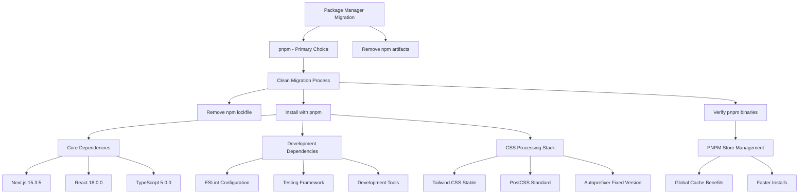
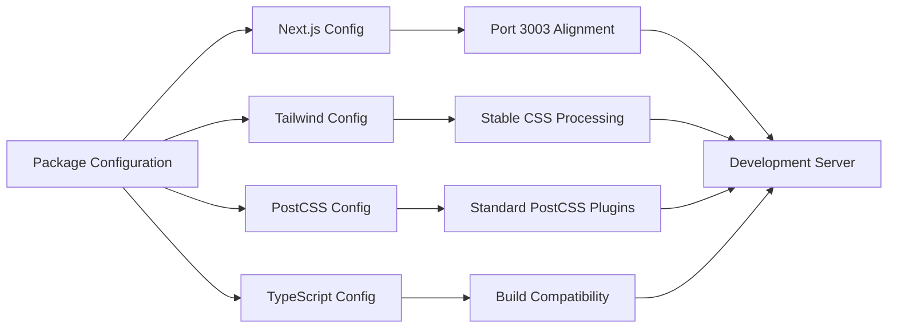

# Frontend Dependency Fix Strategy - PNPM Migration

## Overview

This design addresses critical dependency issues preventing the AI Marketing Web Builder frontend from building and running properly, while migrating from npm to pnpm as the primary package manager. The current state shows corrupted node_modules, missing binaries, lockfile conflicts between npm and pnpm, and configuration mismatches that are blocking development workflow.

## Current Issues Analysis

### Critical Problems Identified

1. **Corrupted Node Modules Installation**
   - Missing `.bin` directory with executable symlinks
   - Broken dependency chains for @swc/helpers, ansi-styles
   - Incomplete package installations despite package.json presence

2. **Package Manager Migration Conflicts**
   - Legacy npm lockfile (package-lock.json) conflicting with pnpm
   - Inconsistent dependency resolution between package managers
   - Node modules structure incompatible between npm and pnpm
   - WSL2 permission issues preventing clean migration

3. **CSS Processing Configuration Issues**
   - Tailwind CSS v4 with experimental features causing instability
   - PostCSS configuration mismatch with Tailwind setup
   - Missing autoprefixer and stable CSS processing dependencies

4. **Build Tool Compatibility**
   - Next.js 15.5.0 with potential compatibility issues
   - TypeScript configuration not aligned with build tools
   - Missing development dependencies for stable builds

## Architecture

### PNPM Migration Strategy



### Configuration Consistency Framework



## Dependency Resolution Strategy

### Phase 1: PNPM Migration Cleanup

**Migration Cleanup Operations:**
- Remove npm lockfile (package-lock.json) - keep pnpm-lock.yaml
- Delete npm-style node_modules directory
- Clear npm cache and initialize pnpm store
- Remove WSL2 permission conflicts
- Install pnpm globally if not present

**Implementation:**
```bash
# PNPM migration cleanup sequence
rm -rf node_modules/
rm -f package-lock.json
npm cache clean --force

# Install pnpm globally if needed
npm install -g pnpm

# Initialize pnpm store and clear cache
pnpm store prune
pnpm cache clear

# WSL2 specific permission reset
sudo chown -R $(whoami) .
```

### Phase 2: PNPM Dependencies Installation

**PNPM Installation Benefits:**
- Faster installation through global store
- Reduced disk space usage with hard links
- Strict dependency resolution preventing phantom dependencies
- Better monorepo support

**Core Framework Dependencies:**
- Next.js: Lock to 15.3.5 (avoid bleeding edge 15.5.0)
- React: Maintain 18.0.0 stable
- TypeScript: Use 5.0.0 for compatibility

**CSS Processing Stack:**
- Tailwind CSS: Keep current v4 but disable experimental features
- PostCSS: Standard configuration with autoprefixer
- Configure lightningcss: false to avoid instability

**Development Tools:**
- ESLint: Stable configuration without experimental features
- Jest: Standard testing setup
- Playwright: Verified working version

### Phase 3: PNPM Configuration Alignment

**Package.json PNPM Optimization:**

```json
{
  "packageManager": "pnpm@8.15.0",
  "scripts": {
    "dev": "next dev --hostname 0.0.0.0 --port 3003",
    "build": "next build",
    "start": "next start",
    "type-check": "tsc --noEmit",
    "lint": "next lint",
    "test": "jest --passWithNoTests",
    "clean": "pnpm store prune && rm -rf node_modules && pnpm install"
  },
  "dependencies": {
    "next": "15.3.5",
    "react": "^18.0.0",
    "react-dom": "^18.0.0",
    "tailwindcss": "^4.0.0",
    "@tailwindcss/postcss": "^4.0.0"
  }
}
```

**PNPM Configuration (.pnpmrc):**

```ini
# .pnpmrc - PNPM configuration
strict-peer-dependencies=false
auto-install-peers=true
prefer-workspace-packages=true
hoist-pattern[]=*eslint*
hoist-pattern[]=*prettier*
registry=https://registry.npmjs.org/
```

**Next.js Configuration Stability:**

```typescript
const nextConfig: NextConfig = {
  env: { HOSTNAME: '0.0.0.0' },
  eslint: { ignoreDuringBuilds: false },
  typescript: { ignoreBuildErrors: false },
  experimental: {
    // Remove experimental features causing issues
  }
};
```

**Tailwind Configuration with Experimental Feature Control:**

```typescript
const config: Config = {
  content: [
    "./src/pages/**/*.{js,ts,jsx,tsx,mdx}",
    "./src/components/**/*.{js,ts,jsx,tsx,mdx}",
    "./src/app/**/*.{js,ts,jsx,tsx,mdx}",
  ],
  theme: {
    extend: {
      // Keep existing custom theme
    },
  },
  plugins: [],
  // Disable experimental features causing issues
  future: {
    hoverOnlyWhenSupported: true,
  },
  experimental: {
    optimizeUniversalDefaults: false,
  },
  corePlugins: {
    // Disable problematic features if needed
  },
};
```

**PostCSS Standard Configuration:**

```javascript
module.exports = {
  plugins: {
    tailwindcss: {},
    autoprefixer: {},
  },
};
```

## Binary and Executable Resolution

### Binary Linking Strategy

**Automatic Binary Resolution:**
- Ensure .bin directory creation during npm install
- Verify executable permissions for all binaries
- Create fallback scripts for WSL2 environments

**PNPM Binary Verification Process:**
```bash
# Verify core binaries exist and are executable with pnpm
pnpm exec next --version
pnpm exec tsc --version
pnpm exec jest --version
pnpm exec tailwindcss --version

# Alternative: Check .bin directory
ls -la node_modules/.bin/next
ls -la node_modules/.bin/tsc
ls -la node_modules/.bin/jest
ls -la node_modules/.bin/tailwindcss
```

**PNPM Binary Access:**
- PNPM exec command: `pnpm exec next dev`
- Direct path access for development: `node node_modules/next/dist/bin/next`
- PNPM scripts with dlx for global packages: `pnpm dlx create-next-app`
- Docker alternative for consistent environment

## Testing Strategy

### Dependency Verification

**PNPM Installation Verification:**
1. PNPM install completes without errors
2. PNPM store properly configured and populated
3. All required binaries accessible via pnpm exec
4. Development server starts on port 3003
5. TypeScript compilation succeeds
6. CSS processing works correctly with Tailwind v4 stable config

**PNPM Build Process Validation:**
1. `pnpm dev` starts development server
2. `pnpm build` creates production build
3. `pnpm type-check` validates TypeScript
4. `pnpm test` runs test suite
5. `pnpm lint` validates code quality
6. `pnpm store status` shows healthy store

### Performance Validation

**Development Experience:**
- Hot reload functionality working
- Fast refresh for React components
- Efficient CSS compilation
- Quick TypeScript checking

**Build Performance:**
- Production build under 30 seconds
- Optimized bundle sizes
- Proper tree shaking
- CSS purging working correctly

## Emergency Recovery Procedures

### Quick Recovery Options

**Option 1: PNPM Fresh Installation Script**
```bash
#!/bin/bash
# emergency-pnpm-recovery.sh
rm -rf node_modules package-lock.json
pnpm store prune
pnpm cache clear
pnpm install --no-optional --frozen-lockfile
pnpm audit --fix
```

**Option 2: Docker Development Environment**
```dockerfile
FROM node:18-alpine

# Install pnpm
RUN npm install -g pnpm

WORKDIR /app

# Copy package files
COPY package.json pnpm-lock.yaml ./
COPY .pnpmrc ./

# Install dependencies with pnpm
RUN pnpm install --frozen-lockfile --prod

COPY . .
EXPOSE 3003
CMD ["pnpm", "dev"]
```

**Option 3: Backup Configuration Restore**
- Keep known-good package.json versions
- Automated rollback to stable configurations
- Version-locked dependency specifications

### Critical Path Recovery

**Immediate Actions for Build Failures:**
1. Stop all running processes (ports 3003, 8000)
2. Execute emergency cleanup script
3. Restore from backup configurations
4. Verify with minimal test suite
5. Gradually restore advanced features

**Rollback Strategy:**
- Maintain stable configuration snapshots
- Quick restoration to last known working state
- Incremental dependency updates with validation
- Automated testing before configuration changes

## Implementation Phases

### Phase 1: PNPM Migration (30 minutes)
1. Install pnpm globally and execute environment cleanup
2. Remove npm artifacts and migrate to pnpm
3. Install dependencies with pnpm
4. Verify basic development server functionality
5. Test TypeScript compilation with pnpm exec

### Phase 2: PNPM Feature Restoration (1 hour)
1. Configure .pnpmrc for optimal settings
2. Restore advanced build features with pnpm
3. Configure CSS processing pipeline with Tailwind v4 stability
4. Set up testing framework with pnpm
5. Verify all pnpm scripts work correctly

### Phase 3: Optimization and Hardening (1 hour)
1. Optimize build performance
2. Implement stability monitoring
3. Create automated recovery scripts
4. Document working configuration

### Phase 4: PNPM Validation and Documentation (30 minutes)
1. Run comprehensive test suite with pnpm
2. Validate all pnpm development workflows
3. Update team documentation for pnpm usage
4. Create pnpm environment setup guide
5. Document pnpm store management and troubleshooting