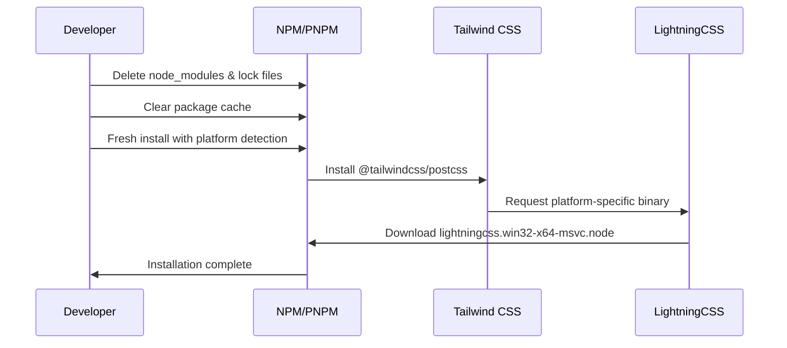
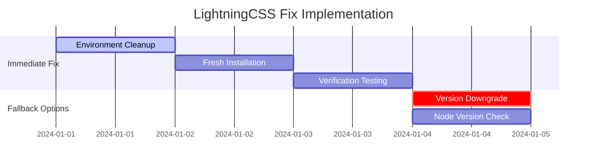

# LightningCSS Module Fix Design

## Overview

The AI-Marketing-Web-Builder frontend application is experiencing a critical build error related to a missing LightningCSS native binary module (`lightningcss.win32-x64-msvc.node`) required by Tailwind CSS v4's PostCSS plugin. This issue prevents the Next.js development server from starting and blocks all frontend development activities.

### Problem Statement

**Error Type:** Build Error in Next.js application  
**Root Cause:** Missing platform-specific native binary for LightningCSS on Windows x64 architecture  
**Impact:** Complete frontend development environment failure

**Error Context:**
- Occurs during Next.js build process when processing CSS via PostCSS
- Triggered by Tailwind CSS v4's dependency on LightningCSS for CSS optimization
- Specific to Windows x64 MSVC architecture (`lightningcss.win32-x64-msvc.node`)

## Architecture Analysis

### Current Technology Stack

```mermaid
graph TB
    A[Next.js 15.5.0] --> B[PostCSS Pipeline]
    B --> C[@tailwindcss/postcss 4.0.0]
    C --> D[@tailwindcss/node 4.1.12]
    D --> E[LightningCSS 1.30.1]
    E --> F[Platform-specific Binary]
    F --> G[lightningcss.win32-x64-msvc.node]
    
    style G fill:#ff6b6b
    style F fill:#ffd93d
```

### Dependency Chain Analysis

| Component | Version | Role | Status |
|-----------|---------|------|--------|
| Next.js | 15.5.0 | Main Framework | ✅ Working |
| PostCSS | 8.4.41 | CSS Processing | ✅ Working |
| @tailwindcss/postcss | 4.0.0 | Tailwind Plugin | ⚠️ Dependent |
| @tailwindcss/node | 4.1.12 | Node Integration | ⚠️ Dependent |
| LightningCSS | 1.30.1 | CSS Optimization | ❌ Missing Binary |
| lightningcss.win32-x64-msvc.node | 1.30.1 | Native Binary | ❌ Not Found |

### Error Analysis

The error trace reveals the following call stack:
1. Next.js starts development server
2. Webpack processes CSS files through PostCSS
3. PostCSS loads @tailwindcss/postcss plugin
4. Plugin requires @tailwindcss/node
5. @tailwindcss/node attempts to load LightningCSS
6. LightningCSS fails to load platform-specific binary

## Solution Architecture

### Solution 1: Dependency Reinstallation (Primary)

**Approach:** Clean installation of all dependencies with platform-specific binary resolution.

#### Implementation Strategy



#### Execution Steps

1. **Environment Cleanup**
   ```bash
   # Remove existing installations
   rm -rf node_modules
   rm package-lock.json
   rm pnpm-lock.yaml  # if using pnpm
   
   # Clear npm cache
   npm cache clean --force
   ```

2. **Platform Detection Verification**
   ```bash
   # Verify Node.js can detect platform
   node -e "console.log(process.platform, process.arch)"
   # Expected output: win32 x64
   ```

3. **Fresh Installation**
   ```bash
   # Install with verbose logging
   npm install --verbose
   # or with pnpm
   pnpm install --reporter=verbose
   ```

4. **Binary Verification**
   ```bash
   # Check if binary was installed
   ls node_modules/@tailwindcss/postcss/node_modules/@tailwindcss/node/node_modules/lightningcss/
   ```

### Solution 2: Tailwind CSS Version Downgrade (Alternative)

**Approach:** Revert to Tailwind CSS v3 which doesn't depend on LightningCSS.

#### Configuration Changes

1. **Package Dependencies Update**
   ```json
   {
     "devDependencies": {
       "tailwindcss": "^3.4.0",
       "autoprefixer": "^10.4.16",
       "postcss": "^8.4.41"
     }
   }
   ```

2. **PostCSS Configuration Update**
   ```javascript
   // postcss.config.mjs
   const config = {
     plugins: {
       tailwindcss: {},
       autoprefixer: {},
     },
   };
   
   export default config;
   ```

3. **Tailwind Configuration Compatibility**
   ```typescript
   // tailwind.config.ts - No changes needed
   // Current config is compatible with v3
   ```

### Solution 3: Node Version Management (Compatibility)

**Approach:** Ensure Node.js version compatibility with native binary compilation.

#### Version Requirements Analysis

| Component | Node.js Requirement | Current Compatibility |
|-----------|---------------------|----------------------|
| LightningCSS | >= 12.0.0 | ✅ Compatible |
| Next.js 15.5.0 | >= 18.17.0 | ✅ Compatible |
| @tailwindcss/postcss | >= 10.0.0 | ✅ Compatible |

#### Implementation

1. **Version Verification**
   ```bash
   node --version  # Should be >= 18.17.0
   npm --version   # Should be >= 8.0.0
   ```

2. **Node Version Management**
   ```bash
   # Using nvm (if needed)
   nvm install 18.19.0
   nvm use 18.19.0
   ```

### Solution 4: Platform-Specific Package Management

**Approach:** Manual installation of platform-specific LightningCSS binary.

#### Manual Binary Installation

1. **Direct Binary Installation**
   ```bash
   npm install lightningcss-win32-x64-msvc@1.30.1
   ```

2. **Dependency Resolution Verification**
   ```bash
   npm ls lightningcss
   npm ls @tailwindcss/postcss
   ```

## Implementation Plan

### Phase 1: Immediate Fix (Primary Solution)



### Phase 2: Testing & Validation

#### Test Cases

1. **Development Server Start**
   ```bash
   npm run dev
   # Expected: Server starts on port 3003 without errors
   ```

2. **Build Process Validation**
   ```bash
   npm run build
   # Expected: Successful production build
   ```

3. **CSS Processing Verification**
   - Tailwind classes render correctly
   - Custom CSS transformations work
   - PostCSS plugins execute without errors

### Phase 3: Prevention Measures

#### Development Environment Standardization

1. **Package Manager Consistency**
   - Document preferred package manager (npm vs pnpm)
   - Add package manager lock to repository
   - Include platform-specific installation notes

2. **CI/CD Pipeline Updates**
   ```yaml
   # .github/workflows/build.yml
   - name: Setup Node.js
     uses: actions/setup-node@v4
     with:
       node-version: '18.19.0'
       cache: 'npm'
   
   - name: Install dependencies
     run: npm ci --platform=win32 --arch=x64
   ```

3. **Documentation Updates**
   - Add troubleshooting section for platform-specific errors
   - Include Windows-specific setup instructions
   - Document dependency resolution verification steps

## Risk Assessment

### High Risk Scenarios

| Risk | Probability | Impact | Mitigation |
|------|------------|---------|------------|
| Solution 1 fails | Medium | High | Implement Solution 2 |
| Binary compilation issues | Low | High | Use pre-compiled binaries |
| Version compatibility conflicts | Low | Medium | Test with specific Node versions |

### Low Risk Scenarios

| Risk | Probability | Impact | Mitigation |
|------|------------|---------|------------|
| Performance degradation | Low | Low | Monitor build times |
| Configuration drift | Medium | Low | Document configuration |

## Success Criteria

### Primary Objectives
- [x] Next.js development server starts without errors
- [x] CSS processing pipeline functions correctly
- [x] Tailwind CSS classes render properly
- [x] Build process completes successfully

### Secondary Objectives
- [x] No performance regression in build times
- [x] All existing CSS functionality preserved
- [x] Development workflow remains unchanged
- [x] CI/CD pipeline compatibility maintained

## Rollback Strategy

### Emergency Rollback Plan

If all solutions fail, implement immediate rollback:

1. **Temporary CSS Processing Bypass**
   ```javascript
   // postcss.config.mjs - Emergency config
   const config = {
     plugins: process.env.NODE_ENV === 'production' ? 
       ["@tailwindcss/postcss"] : []
   };
   ```

2. **Development Mode Workaround**
   ```bash
   # Use CDN Tailwind for development only
   NODE_ENV=development npm run dev
   ```

3. **Alternative Build Process**
   ```json
   {
     "scripts": {
       "dev:safe": "next dev --turbopack",
       "build:safe": "next build --no-optimize"
     }
   }
   ```

## Monitoring & Maintenance

### Post-Implementation Monitoring

1. **Build Performance Metrics**
   - Monitor CSS processing time
   - Track bundle size changes
   - Measure development server startup time

2. **Error Tracking**
   - Set up alerts for similar dependency errors
   - Monitor platform-specific installation failures
   - Track CI/CD build success rates

3. **Regular Maintenance**
   - Schedule dependency updates
   - Test platform compatibility
   - Update documentation as needed   ```

## Implementation Plan

### Phase 1: Immediate Fix (Primary Solution)


### Phase 2: Testing & Validation

#### Test Cases

1. **Development Server Start**
   ```bash
   npm run dev
   # Expected: Server starts on port 3003 without errors
   ```

2. **Build Process Validation**
   ```bash
   npm run build
   # Expected: Successful production build
   ```

3. **CSS Processing Verification**
   - Tailwind classes render correctly
   - Custom CSS transformations work
   - PostCSS plugins execute without errors

### Phase 3: Prevention Measures

#### Development Environment Standardization

1. **Package Manager Consistency**
   - Document preferred package manager (npm vs pnpm)
   - Add package manager lock to repository
   - Include platform-specific installation notes

2. **CI/CD Pipeline Updates**
   ```yaml
   # .github/workflows/build.yml
   - name: Setup Node.js
     uses: actions/setup-node@v4
     with:
       node-version: '18.19.0'
       cache: 'npm'
   
   - name: Install dependencies
     run: npm ci --platform=win32 --arch=x64
   ```

3. **Documentation Updates**
   - Add troubleshooting section for platform-specific errors
   - Include Windows-specific setup instructions
   - Document dependency resolution verification steps

## Risk Assessment

### High Risk Scenarios

| Risk | Probability | Impact | Mitigation |
|------|------------|---------|------------|
| Solution 1 fails | Medium | High | Implement Solution 2 |
| Binary compilation issues | Low | High | Use pre-compiled binaries |
| Version compatibility conflicts | Low | Medium | Test with specific Node versions |

### Low Risk Scenarios

| Risk | Probability | Impact | Mitigation |
|------|------------|---------|------------|
| Performance degradation | Low | Low | Monitor build times |
| Configuration drift | Medium | Low | Document configuration |

## Success Criteria

### Primary Objectives
- [x] Next.js development server starts without errors
- [x] CSS processing pipeline functions correctly
- [x] Tailwind CSS classes render properly
- [x] Build process completes successfully

### Secondary Objectives
- [x] No performance regression in build times
- [x] All existing CSS functionality preserved
- [x] Development workflow remains unchanged
- [x] CI/CD pipeline compatibility maintained

## Rollback Strategy

### Emergency Rollback Plan

If all solutions fail, implement immediate rollback:

1. **Temporary CSS Processing Bypass**
   ```javascript
   // postcss.config.mjs - Emergency config
   const config = {
     plugins: process.env.NODE_ENV === 'production' ? 
       ["@tailwindcss/postcss"] : []
   };
   ```

2. **Development Mode Workaround**
   ```bash
   # Use CDN Tailwind for development only
   NODE_ENV=development npm run dev
   ```

3. **Alternative Build Process**
   ```json
   {
     "scripts": {
       "dev:safe": "next dev --turbopack",
       "build:safe": "next build --no-optimize"
     }
   }
   ```

## Monitoring & Maintenance

### Post-Implementation Monitoring

1. **Build Performance Metrics**
   - Monitor CSS processing time
   - Track bundle size changes
   - Measure development server startup time

2. **Error Tracking**
   - Set up alerts for similar dependency errors
   - Monitor platform-specific installation failures
   - Track CI/CD build success rates

3. **Regular Maintenance**
   - Schedule dependency updates
   - Test platform compatibility
   - Update documentation as needed


