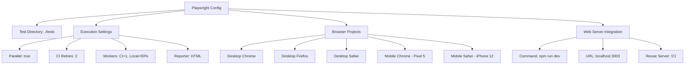
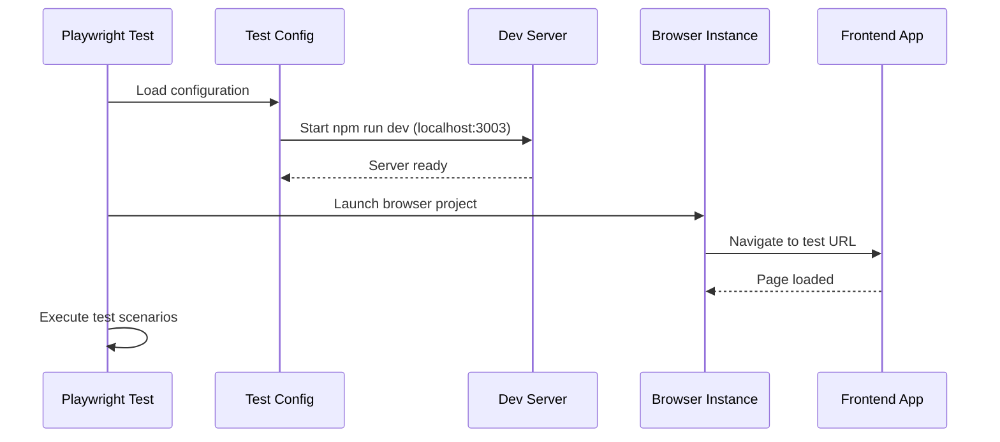
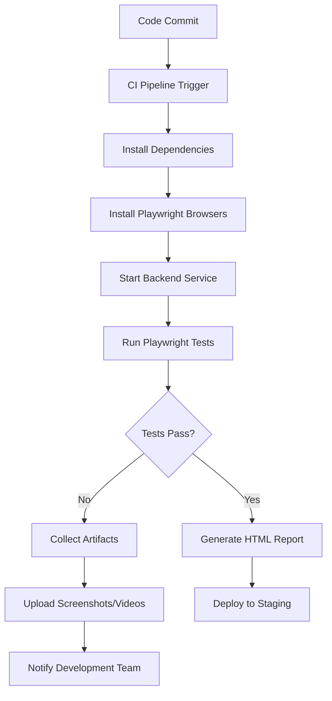
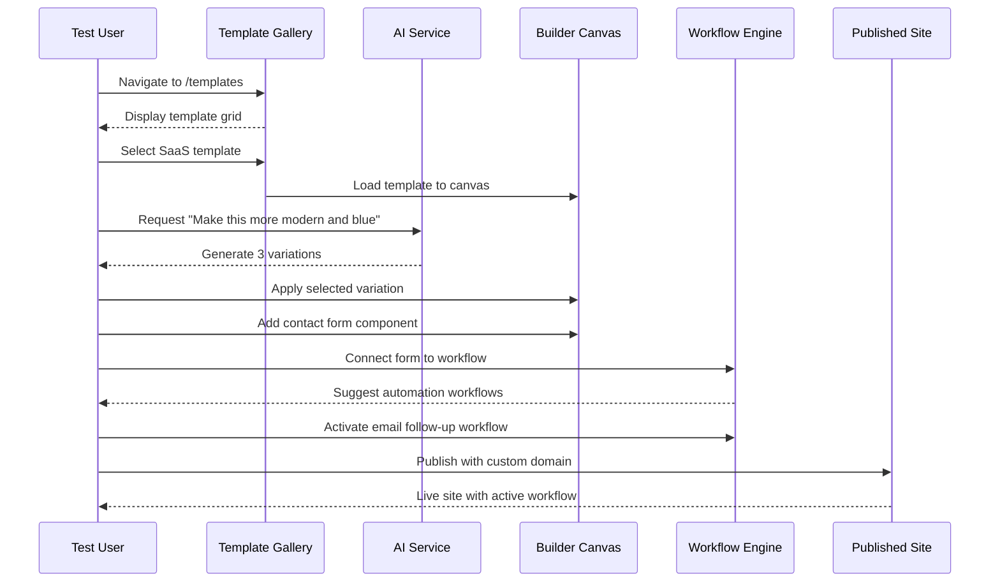

# Playwright Test Setup Design

## Overview

The Playwright test setup for the AI Marketing Web Builder provides comprehensive end-to-end testing capabilities for the frontend application. This design covers the configuration, test architecture, execution strategies, and best practices for testing complex user interactions including drag-and-drop functionality, AI-powered customization, and workflow automation.

## Technology Stack & Dependencies

| Component | Technology | Version | Purpose |
|-----------|------------|---------|---------|
| Test Framework | Playwright | ^1.51.0 | Cross-browser E2E testing |
| Test Runner | @playwright/test | - | Built-in test runner with reporting |
| Configuration | TypeScript | - | Type-safe test configuration |
| Target Application | Next.js 14 | - | Frontend application under test |
| Development Server | localhost:3003 | - | Test target URL |

## Configuration Architecture

### Playwright Configuration Structure

The `playwright.config.ts` file defines a comprehensive testing environment with the following architecture:



### Key Configuration Features

- **Parallel Execution**: `fullyParallel: true` enables concurrent test execution
- **CI/CD Optimization**: Conditional retries (2x in CI, 0x locally) and worker allocation
- **Cross-Browser Testing**: Chromium, Firefox, WebKit, and mobile device simulation
- **Development Integration**: Automatic dev server startup with reuse capability
- **Debug Artifacts**: Screenshots, videos, and traces captured on failures

### Debugging and Artifact Collection

| Artifact Type | Trigger | Purpose |
|---------------|---------|---------|
| Screenshots | `only-on-failure` | Visual debugging of failed states |
| Videos | `retain-on-failure` | Full interaction recording for failures |
| Traces | `on-first-retry` | Detailed execution timeline and DOM snapshots |

## Test Structure & Organization

### Test Directory Architecture

```
tests/
├── e2e/                                 # End-to-end test suites
│   ├── ai-customization.spec.ts        # AI feature testing
│   ├── component-library.spec.ts       # Component drag-and-drop testing
│   ├── deployment-validation.spec.ts   # Deployment workflow validation
│   ├── magic-moment.spec.ts           # Core user journey testing
│   ├── mvp-user-journey.spec.ts       # MVP feature validation
│   ├── performance-validation.spec.ts  # Performance benchmarking
│   ├── story-3.1-workflow-debugging.spec.ts # Workflow debugging features
│   └── story-3.2-smart-templates.spec.ts    # Smart template functionality
└── integration/                        # Integration test suites
    └── [5 integration test files]
```

### Test Categories and Scope

| Test Category | Files | Coverage Area |
|---------------|-------|---------------|
| **Core User Journey** | `magic-moment.spec.ts`, `mvp-user-journey.spec.ts` | Template selection → customization → publishing |
| **AI Features** | `ai-customization.spec.ts`, `story-3.2-smart-templates.spec.ts` | Natural language editing, template recommendations |
| **Component System** | `component-library.spec.ts` | Drag-and-drop, component rendering, property editing |
| **Workflow Automation** | `story-3.1-workflow-debugging.spec.ts` | Magic Connector, workflow execution, debugging |
| **Performance & Deployment** | `performance-validation.spec.ts`, `deployment-validation.spec.ts` | Load testing, deployment validation |

## Test Execution Strategies

### Test Environment Setup



### API Mocking and Environment Isolation

The test framework implements sophisticated environment preparation:

- **API Route Interception**: `page.route('**/api/v1/**')` for consistent test data
- **Authentication Simulation**: Mock user sessions and permissions  
- **Database State Independence**: Tests isolated from backend database state
- **Service Mocking**: External AI services and integrations mocked for reliability

### Performance Benchmarking Integration

Key performance metrics tracked during testing:

| Metric | Target | Test Coverage |
|--------|--------|---------------|
| AI Customization Response | < 5 seconds | `ai-customization.spec.ts` |
| Template Loading | < 3 seconds | `magic-moment.spec.ts` |
| Component Rendering | < 2 seconds | `component-library.spec.ts` |
| Workflow Creation | < 10 seconds | `story-3.1-workflow-debugging.spec.ts` |
| Site Publishing | < 30 seconds | `deployment-validation.spec.ts` |

## Test Execution Commands

### Available Test Scripts

| Command | Purpose | Configuration |
|---------|---------|---------------|
| `npm run test:e2e` | Run all E2E tests | Standard execution |
| `npm run test:e2e:ui` | Interactive test UI | Visual test debugging |
| `npm run test:mvp` | MVP journey tests | Core functionality validation |
| `npm run test:deployment` | Deployment validation | Pre-production checks |
| `npm run test:performance` | Performance benchmarks | Load and response time testing |
| `npm run test:full-mvp` | Complete MVP suite | Combined MVP + deployment |
| `npm run playwright:install` | Install browser binaries | Setup command |

### CI/CD Integration



### Environment-Specific Execution

| Environment | Workers | Retries | Server Reuse | Artifacts |
|-------------|---------|---------|--------------|-----------|
| **Local Development** | 50% of CPU cores | 0 | Yes | On failure only |
| **CI/CD Pipeline** | 1 (sequential) | 2 per test | No | Full collection |
| **Pull Request** | 1 | 2 | No | Screenshots + traces |

## Complex User Journey Testing

### Magic Moment Test Flow

The core user journey test (`magic-moment.spec.ts`) validates the complete platform workflow:



### Test Data Patterns

| Test Scenario | Data Requirements | Validation Points |
|---------------|-------------------|-------------------|
| **Template Customization** | AI prompts, style variations | Visual consistency, response time |
| **Component Integration** | Drag-and-drop coordinates | Canvas positioning, property binding |
| **Workflow Connection** | Form fields, automation rules | Trigger configuration, execution logs |
| **Site Publishing** | Domain names, deployment configs | URL accessibility, content accuracy |

## Testing Best Practices

### Test Design Principles

1. **Test Isolation**: Each test maintains independent state and cleanup
2. **Deterministic Execution**: Mocked external dependencies for consistent results
3. **Performance Monitoring**: Response time validation integrated into functional tests
4. **Cross-Browser Validation**: Critical paths tested across all supported browsers
5. **Mobile Responsiveness**: Mobile device simulation for responsive design validation

### Maintenance and Debugging

| Debugging Tool | Use Case | Access Method |
|----------------|----------|---------------|
| **Playwright UI** | Interactive test development | `npm run test:e2e:ui` |
| **HTML Reports** | CI/CD test results analysis | Auto-generated after test runs |
| **Video Recordings** | Failed test reproduction | Retained in test-results/ directory |
| **Trace Viewer** | Detailed execution inspection | Playwright trace viewer tool |

### Test Data Management

- **Static Test Data**: Predefined templates, components, and workflow configurations
- **Dynamic Generation**: AI-generated variations and responses  
- **Environment Seeding**: Consistent user accounts and permissions across test environments
- **Cleanup Strategies**: Automated removal of test-generated sites and data

## Error Handling & Recovery

### Failure Scenarios and Recovery

```mermaid
flowchart TD
    A[Test Execution] --> B{Test Result}
    B -->|Pass| C[Generate Success Report]
    B -->|Fail| D[Capture Artifacts]
    D --> E[Screenshot + Video + Trace]
    E --> F{Retry Enabled?}
    F -->|Yes CI| G[Retry Test (max 2x)]
    F -->|No Local| H[Report Failure]
    G --> I{Retry Result}
    I -->|Pass| C
    I -->|Fail| H
    H --> J[Notify Development Team]
```

### Common Failure Patterns

| Failure Type | Symptoms | Resolution Strategy |
|--------------|----------|-------------------|
| **Timing Issues** | Element not found, premature actions | Increase wait times, use proper selectors |
| **Network Failures** | API timeouts, service unavailable | Implement retry logic, mock external services |
| **Browser Inconsistencies** | Cross-browser rendering differences | Browser-specific test configurations |
| **Performance Degradation** | Tests exceeding time limits | Performance profiling, infrastructure scaling |

This Playwright test setup provides comprehensive coverage of the AI Marketing Web Builder's frontend functionality while maintaining reliability, performance, and maintainability across different environments and browsers.