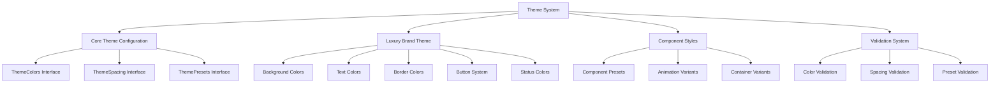
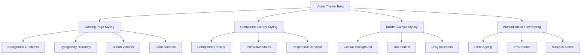

# Theme Styling Test Design

## Overview

This design document outlines a comprehensive testing strategy using Playwright MCP to validate theme styling functionality in the AI Marketing Web Builder project. Based on the current codebase analysis, this document identifies potential styling issues and provides systematic testing approaches to verify theme implementation.

## Architecture Analysis

### Current Theme System Structure

The project implements a sophisticated theme system with the following components:

### Key Theme Components

1. **Master Theme Interface** (`src/lib/theme.ts`)
   - TypeScript interfaces for type safety
   - Centralized color, spacing, and preset definitions
   - Luxury brand theme with gold/black palette
   - Component-specific styling utilities

2. **Landing Page Implementation** (`src/components/landing/LandingLayout.tsx`)
   - Uses gradient backgrounds: `bg-gradient-to-br from-black via-gray-900 to-black`
   - Modular component structure (Header, Hero, Demo, Features, Footer)

3. **Theme Validation System** (`src/lib/theme-validation.js`)
   - Automated validation for required colors
   - 8px grid spacing system verification
   - Preset configuration checks

## Playwright MCP Testing Strategy

### Test Scenarios for Theme Validation

#### 1. Visual Regression Testing

#### 2. Theme Consistency Validation

**Core Requirements to Test:**
- Dark theme implementation (AC: 2, 3)
- WCAG 2.1 AA contrast compliance
- 8px grid spacing system (AC: 4)
- Component preset functionality (AC: 5)
- Luxury brand color palette consistency

#### 3. Interactive Component Testing

**Button System Validation:**
- Primary luxury button: `bg-gradient-to-r from-yellow-400 to-yellow-500`
- Secondary professional button: `bg-transparent border-2 border-gray-600`
- Ghost button behavior
- Hover state animations
- Focus state accessibility

#### 4. Responsive Design Testing

**Breakpoint Validation:**
- Mobile responsive behavior
- Tablet layout adaptations
- Desktop experience optimization
- Touch interface compatibility

### Testing Implementation Plan

#### Phase 1: Basic Theme Loading Tests

1. **Page Load Validation**
   - Verify main page loads with correct background gradients
   - Check CSS class application
   - Validate font loading and typography
   - Test initial render performance

2. **Component Rendering Tests**
   - Verify Header component styling
   - Check HeroSection visual presentation
   - Validate BuilderDemo component appearance
   - Test FeaturesSection layout and styling
   - Confirm Footer implementation

#### Phase 2: Interactive Element Testing

1. **Button Interaction Tests**
   - Test all button variants (primary, secondary, ghost, outline)
   - Verify hover state transitions
   - Check focus indicators for accessibility
   - Validate click state feedback

2. **Form Element Testing**
   - Input field styling consistency
   - Form validation error state appearance
   - Success state visual feedback
   - Focus and active state behavior

#### Phase 3: Theme Consistency Validation

1. **Color System Tests**
   - Verify luxury gold palette implementation
   - Check background gradient rendering
   - Validate text color contrast ratios
   - Test status color implementations

2. **Spacing System Tests**
   - Validate 8px grid system compliance
   - Check component padding consistency
   - Verify margin calculations
   - Test responsive spacing behavior

#### Phase 4: Performance and Accessibility Testing

1. **Performance Validation**
   - CSS loading time measurement
   - Theme switching performance (if applicable)
   - Animation frame rate testing
   - Memory usage during theme operations

2. **Accessibility Compliance**
   - Color contrast ratio validation
   - Focus indicator visibility
   - Screen reader compatibility
   - Keyboard navigation support

### Test Data and Assertions

#### Expected Visual Elements

**Landing Page Elements:**
- Background: `bg-gradient-to-br from-black via-gray-900 to-black`
- Primary text: `text-white`
- Secondary text: `text-gray-300`
- Accent elements: `text-yellow-400`
- Button gradients: `from-yellow-400 to-yellow-500`

**Color Validation Checklist:**
- `bg-gray-900` (primary background)
- `bg-gray-800` (secondary background)
- `bg-yellow-400` (accent background)
- `text-white` (primary text)
- `text-gray-300` (secondary text)
- `text-yellow-400` (accent text)

**Spacing Validation:**
- 8px increments: `8px`, `16px`, `24px`, `32px`, `40px`
- Component padding consistency
- Grid alignment verification

### Risk Assessment and Mitigation

#### Potential Styling Issues Identified

1. **Theme Import Problems**
   - Risk: Components not importing theme utilities correctly
   - Mitigation: Test component isolation and theme dependency

2. **CSS Class Application**
   - Risk: Tailwind classes not being applied or compiled
   - Mitigation: Verify build process and CSS generation

3. **Responsive Breakpoint Issues**
   - Risk: Theme not adapting properly across screen sizes
   - Mitigation: Multi-device testing with Playwright

4. **Performance Degradation**
   - Risk: Complex gradients and animations causing performance issues
   - Mitigation: Performance benchmarking during theme tests

#### Testing Environment Configuration

**Playwright Configuration Requirements:**
- Multiple browser testing (Chromium, Firefox, WebKit)
- Mobile device simulation
- Screenshot comparison capabilities
- Performance metric collection
- Accessibility testing integration

**Test Infrastructure Setup:**
- Local development server on localhost:3000
- Theme validation utilities
- Visual regression baselines
- Performance benchmarking tools

### Implementation Checklist

#### Pre-Test Setup
- [ ] Verify development server is running
- [ ] Confirm theme.ts file is properly compiled
- [ ] Check Tailwind CSS configuration
- [ ] Validate component imports

#### Core Theme Tests
- [ ] Landing page background gradient rendering
- [ ] Typography hierarchy implementation
- [ ] Button variant styling and interactions
- [ ] Color contrast compliance
- [ ] Spacing system adherence

#### Interactive Element Tests
- [ ] Hover state animations
- [ ] Focus indicator visibility
- [ ] Click feedback mechanisms
- [ ] Form element styling consistency

#### Responsive Design Tests
- [ ] Mobile layout adaptation
- [ ] Tablet breakpoint behavior
- [ ] Desktop optimization
- [ ] Cross-browser consistency

#### Performance and Accessibility
- [ ] CSS loading performance
- [ ] Animation smoothness
- [ ] Screen reader compatibility
- [ ] Keyboard navigation support

This comprehensive testing strategy using Playwright MCP will systematically validate the theme styling implementation and identify any issues preventing proper visual presentation of the AI Marketing Web Builder interface.