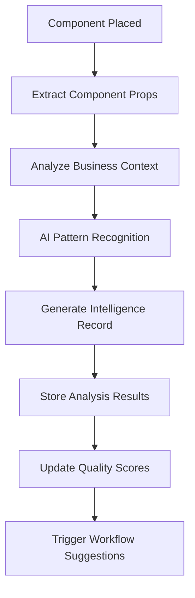
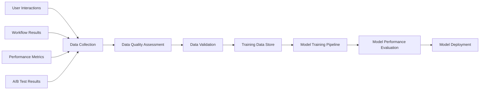
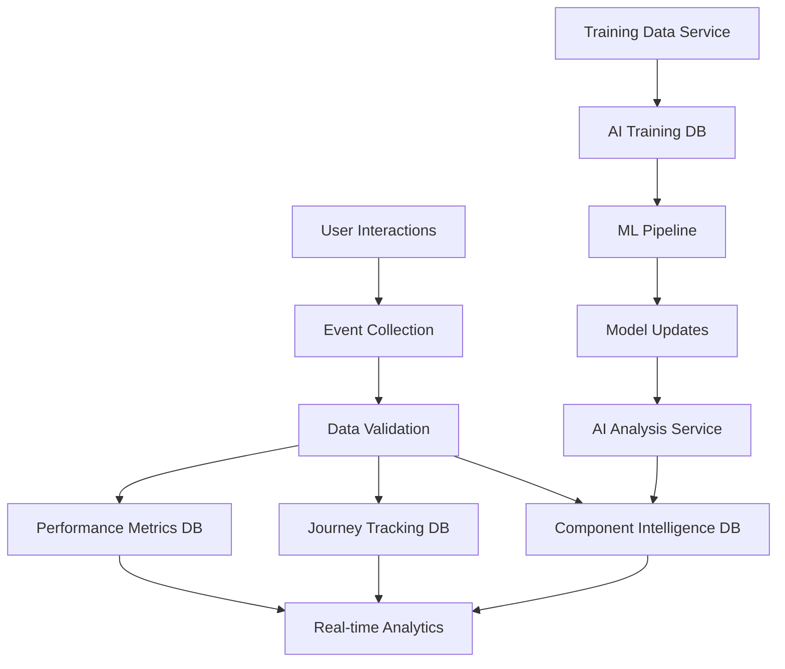

# AI Marketing Web Builder - Data Architecture

## Overview

This document defines the comprehensive data architecture supporting the Magic Connector system and AI-driven features of the AI Marketing Web Builder platform. The architecture enables the critical 30-minute template-to-live-site journey while providing intelligent component analysis, workflow suggestions, and continuous performance optimization.

## 1. Component Analysis Data Model

The Component Analysis Data Model powers the Magic Connector's ability to understand and analyze UI components for workflow suggestions.

### ComponentIntelligence Model

```typescript
interface ComponentIntelligence {
  id: string;
  componentId: string;
  componentType: ComponentIntelligenceType;
  projectId: number;
  templateId?: number;
  
  // AI Analysis Results
  analysisStatus: AnalysisStatus;
  triggerType?: string;
  successProbability?: number;  // 0-1
  confidenceScore?: number;     // 0-1
  
  // Component Properties
  componentProps: Record<string, any>;
  detectedPatterns: string[];
  interactionSignals: Record<string, any>;
  
  // Business Context
  businessContext: Record<string, any>;
  industryTags: string[];
  useCaseClassification?: string;
  
  // Performance Tracking
  analysisResponseTime?: number;  // milliseconds
  lastAnalyzedAt?: Date;
  analysisVersion: string;
  
  // Quality Metrics
  qualityScore?: number;           // 0-100
  themeConsistencyScore?: number;  // 0-100
  userExperienceScore?: number;    // 0-100
  
  createdAt: Date;
  updatedAt: Date;
}
```

### Component Intelligence Types

```typescript
enum ComponentIntelligenceType {
  FORM_HANDLER = "form_handler",
  BUTTON_TRIGGER = "button_trigger",
  CHAT_WIDGET = "chat_widget",
  NEWSLETTER_SIGNUP = "newsletter_signup",
  CONTACT_FORM = "contact_form",
  DOWNLOAD_GATE = "download_gate",
  POPUP_MODAL = "popup_modal",
  NAVIGATION_ELEMENT = "navigation_element",
  SOCIAL_PROOF = "social_proof",
  PRICING_TABLE = "pricing_table"
}
```

### Data Flow



## 2. User Journey Data

The User Journey Data Model tracks the critical 30-minute template-to-live-site experience and identifies optimization opportunities.

### UserJourneyTracking Model

```typescript
interface UserJourneyTracking {
  id: string;
  userId: number;
  sessionId: string;
  projectId: number;
  templateId?: number;
  
  // Journey Timing
  journeyStartedAt: Date;
  templateSelectedAt?: Date;
  firstCustomizationAt?: Date;
  firstWorkflowConnectedAt?: Date;
  sitePublishedAt?: Date;
  magicMomentAchievedAt?: Date;
  
  // Journey Milestones
  templateSelected: boolean;
  customizationStarted: boolean;
  firstComponentAdded: boolean;
  aiCustomizationUsed: boolean;
  workflowConnected: boolean;
  sitePreviewed: boolean;
  sitePublished: boolean;
  magicMomentAchieved: boolean;
  
  // Progress Metrics
  totalTimeMinutes?: number;
  customizationCount: number;
  aiRequestsCount: number;
  componentsAdded: number;
  workflowsCreated: number;
  
  // Quality Scores
  finalQualityScore?: number;     // 0-100
  userSatisfaction?: number;      // 1-10
  completionQuality?: string;     // excellent, good, average, poor
  
  // Journey Data
  journeyEvents: JourneyEvent[];
  painPoints: string[];
  successFactors: string[];
  finalTemplateConfig: Record<string, any>;
  
  createdAt: Date;
  updatedAt: Date;
}
```

### Journey Event Tracking

```typescript
interface JourneyEvent {
  timestamp: Date;
  eventType: string;
  eventData: Record<string, any>;
  duration?: number;  // milliseconds
  success: boolean;
  errorMessage?: string;
}
```

### Journey Analytics Queries

```sql
-- Magic Moment Success Rate by Template
SELECT 
  t.name as template_name,
  COUNT(*) as total_journeys,
  COUNT(CASE WHEN ujt.magic_moment_achieved = true THEN 1 END) as magic_moments,
  (COUNT(CASE WHEN ujt.magic_moment_achieved = true THEN 1 END) * 100.0 / COUNT(*)) as success_rate,
  AVG(ujt.total_time_minutes) as avg_completion_time
FROM user_journey_tracking ujt
JOIN templates t ON ujt.template_id = t.id
WHERE ujt.created_at >= NOW() - INTERVAL '30 days'
GROUP BY t.id, t.name
ORDER BY success_rate DESC;

-- Journey Pain Point Analysis
SELECT 
  pain_point,
  COUNT(*) as occurrence_count,
  AVG(total_time_minutes) as avg_impact_on_time
FROM user_journey_tracking ujt,
     JSON_ARRAY_ELEMENTS_TEXT(ujt.pain_points) as pain_point
WHERE ujt.created_at >= NOW() - INTERVAL '7 days'
GROUP BY pain_point
ORDER BY occurrence_count DESC;
```

## 3. AI Training Data

The AI Training Data Model enables continuous improvement of component analysis and workflow suggestions.

### AITrainingData Model

```typescript
interface AITrainingData {
  id: string;
  sourceType: TrainingDataSource;
  sourceId: string;
  
  // Training Data Content
  inputData: Record<string, any>;
  expectedOutput: Record<string, any>;
  actualOutput?: Record<string, any>;
  
  // Quality and Validation
  dataQualityScore: number;  // 0-1
  isValidated: boolean;
  validationSource?: string;
  
  // Performance Impact
  performanceImprovement?: number;  // percentage
  modelAccuracyBefore?: number;
  modelAccuracyAfter?: number;
  
  // Metadata
  componentType?: string;
  workflowCategory?: string;
  userFeedbackScore?: number;  // 1-10
  
  // Usage in Training
  usedInTraining: boolean;
  trainingBatchId?: string;
  trainingDate?: Date;
  
  // Context
  userId?: number;
  projectId?: number;
  
  createdAt: Date;
  updatedAt: Date;
}
```

### Training Data Sources

```typescript
enum TrainingDataSource {
  USER_FEEDBACK = "user_feedback",
  PERFORMANCE_METRICS = "performance_metrics",
  WORKFLOW_SUCCESS = "workflow_success",
  COMPONENT_USAGE = "component_usage",
  TEMPLATE_PERFORMANCE = "template_performance",
  A_B_TEST_RESULTS = "a_b_test_results"
}
```

### Training Data Pipeline



## 4. Template Data Architecture

The Template Data Architecture manages 30+ premium templates with AI-enhanced metadata for intelligent customization.

### TemplateAIMetadata Model

```typescript
interface TemplateAIMetadata {
  id: string;
  templateId: number;
  
  // AI-Generated Descriptions
  aiDescription: string;
  targetAudience: string[];
  useCases: string[];
  industryFocus: string[];
  
  // Component Intelligence
  intelligentComponents: ComponentMetadata[];
  workflowCompatibility: Record<string, any>;
  customizationSuggestions: CustomizationSuggestion[];
  
  // Performance Predictions
  predictedConversionRate?: number;
  predictedEngagementScore?: number;
  estimatedSetupTime: number;  // minutes
  
  // Design Intelligence
  designPatterns: string[];
  colorPsychology: Record<string, any>;
  layoutEffectiveness: Record<string, any>;
  responsiveBreakpoints: Record<string, any>;
  
  // AI Training and Quality
  aiConfidenceScore: number;
  trainingDataCount: number;
  lastAiUpdate: Date;
  
  // Performance Tracking
  actualConversionRate?: number;
  actualEngagementScore?: number;
  predictionAccuracy?: number;
  usageSatisfaction?: number;
  
  createdAt: Date;
  updatedAt: Date;
}
```

### Component Metadata

```typescript
interface ComponentMetadata {
  componentId: string;
  type: string;
  suggestedWorkflows: string[];
  customizationOptions: Record<string, any>;
  performanceMetrics: Record<string, any>;
}
```

### Template Performance Analytics

```sql
-- Template Success Rate Analysis
SELECT 
  t.name,
  t.category,
  tam.predicted_conversion_rate,
  tam.actual_conversion_rate,
  tam.prediction_accuracy,
  COUNT(p.id) as usage_count,
  AVG(ujt.user_satisfaction) as avg_satisfaction
FROM templates t
JOIN template_ai_metadata tam ON t.id = tam.template_id
LEFT JOIN projects p ON t.id = p.template_id
LEFT JOIN user_journey_tracking ujt ON p.id = ujt.project_id
GROUP BY t.id, t.name, t.category, tam.predicted_conversion_rate, tam.actual_conversion_rate, tam.prediction_accuracy
ORDER BY usage_count DESC, avg_satisfaction DESC;
```

## 5. Performance Data

The Performance Data Model tracks theme consistency metrics, component quality scores, and system performance across the platform.

### PerformanceMetrics Model

```typescript
interface PerformanceMetrics {
  id: string;
  metricType: string;
  entityType: string;  // component, workflow, template, user
  entityId: string;
  
  // Performance Data
  metricValue: number;
  metricUnit: string;  // seconds, percentage, count
  baselineValue?: number;
  targetValue?: number;
  
  // Context and Metadata
  measurementContext: Record<string, any>;
  measurementMethod: string;
  dataSource: string;
  
  // Quality Indicators
  dataReliability: number;  // 0-1
  sampleSize?: number;
  confidenceInterval?: number;
  
  // Temporal Data
  measurementPeriodStart: Date;
  measurementPeriodEnd: Date;
  aggregationLevel: string;  // hourly, daily, weekly, monthly
  
  // Trend Analysis
  trendDirection?: string;    // improving, declining, stable
  changePercentage?: number;
  changeSignificance?: string; // significant, minor, negligible
  
  // Performance Categories
  isCriticalMetric: boolean;
  alertThreshold?: number;
  performanceStatus: string;  // excellent, good, normal, poor, critical
  
  // Relationships
  userId?: number;
  projectId?: number;
  
  createdAt: Date;
  updatedAt: Date;
}
```

### Key Performance Metrics

```typescript
// Theme Consistency Metrics
interface ThemeConsistencyMetrics {
  colorVarianceScore: number;      // 0-100
  typographyConsistencyScore: number; // 0-100
  spacingConsistencyScore: number;    // 0-100
  componentAlignmentScore: number;    // 0-100
  overallConsistencyScore: number;    // 0-100
}

// Component Quality Metrics
interface ComponentQualityMetrics {
  accessibilityScore: number;      // 0-100
  performanceScore: number;        // 0-100
  responsiveScore: number;         // 0-100
  usabilityScore: number;          // 0-100
  semanticScore: number;           // 0-100
}

// AI System Performance
interface AIPerformanceMetrics {
  analysisResponseTime: number;    // milliseconds
  predictionAccuracy: number;      // 0-100
  suggestionRelevance: number;     // 0-100
  userSatisfactionScore: number;   // 1-10
}
```

### Performance Dashboard Queries

```sql
-- Real-time Performance Dashboard
SELECT 
  metric_type,
  AVG(metric_value) as avg_value,
  MIN(metric_value) as min_value,
  MAX(metric_value) as max_value,
  COUNT(*) as sample_count,
  performance_status
FROM performance_metrics
WHERE measurement_period_start >= NOW() - INTERVAL '1 hour'
  AND is_critical_metric = true
GROUP BY metric_type, performance_status
ORDER BY metric_type;

-- Component Quality Trends
SELECT 
  DATE(measurement_period_start) as date,
  entity_id as component_id,
  AVG(CASE WHEN metric_type = 'quality_score' THEN metric_value END) as quality_score,
  AVG(CASE WHEN metric_type = 'theme_consistency' THEN metric_value END) as consistency_score,
  AVG(CASE WHEN metric_type = 'user_experience' THEN metric_value END) as ux_score
FROM performance_metrics
WHERE entity_type = 'component'
  AND measurement_period_start >= NOW() - INTERVAL '30 days'
GROUP BY DATE(measurement_period_start), entity_id
ORDER BY date DESC, quality_score DESC;
```

## 6. Workflow Data Model

The Workflow Data Model supports CRM integration and automation data patterns for the Magic Connector system.

### Enhanced Workflow Models

```typescript
// Extended from existing Workflow model
interface WorkflowEnhanced extends Workflow {
  // Magic Connector specific fields
  componentIntelligenceId?: string;
  suggestedByAI: boolean;
  aiConfidenceScore?: number;
  
  // Performance Analytics
  averageExecutionTime?: number;  // milliseconds
  successRate: number;           // calculated property
  errorRate: number;             // calculated property
  
  // CRM Integration
  crmContactsCreated: number;
  crmActivitiesGenerated: number;
  emailCampaignsTriggered: number;
  
  // Business Impact
  conversionRate?: number;
  revenueGenerated?: number;
  customerLifetimeValue?: number;
}
```

### ComponentWorkflowConnection Model

```typescript
interface ComponentWorkflowConnection {
  id: string;
  componentIntelligenceId: number;
  workflowId: number;
  suggestionId?: number;
  
  // Connection Status
  status: WorkflowConnectionStatus;
  connectionConfig: Record<string, any>;
  
  // Performance Metrics
  triggerCount: number;
  successCount: number;
  errorCount: number;
  averageResponseTime?: number;  // milliseconds
  
  // Quality Tracking
  userSatisfactionScore?: number;  // 1-10
  conversionRate?: number;         // percentage
  engagementScore?: number;        // 0-100
  
  // Timing Information
  connectedAt?: Date;
  activatedAt?: Date;
  lastTriggeredAt?: Date;
  
  createdAt: Date;
  updatedAt: Date;
}
```

### CRM Integration Data Patterns

```typescript
// Contact Enrichment from Workflow Data
interface ContactWorkflowEnrichment {
  contactId: string;
  workflowId: string;
  
  // Behavioral Data
  workflowTriggers: WorkflowTriggerEvent[];
  engagementScore: number;
  interactionHistory: InteractionEvent[];
  
  // Lead Scoring
  behaviorScore: number;
  demographicScore: number;
  engagementScore: number;
  totalLeadScore: number;
  
  // Automation Results
  emailsReceived: number;
  emailsOpened: number;
  emailsClicked: number;
  formsSubmitted: number;
  pagesVisited: string[];
  
  lastUpdated: Date;
}

// Workflow Performance Analytics
interface WorkflowAnalytics {
  workflowId: string;
  period: DateRange;
  
  // Execution Metrics
  totalExecutions: number;
  successfulExecutions: number;
  failedExecutions: number;
  averageExecutionTime: number;
  
  // Business Metrics
  contactsCreated: number;
  opportunitiesGenerated: number;
  revenue: number;
  conversionRate: number;
  
  // Engagement Metrics
  emailsSent: number;
  emailOpenRate: number;
  emailClickRate: number;
  unsubscribeRate: number;
}
```

### Workflow Data Aggregation Queries

```sql
-- Workflow Performance Summary
SELECT 
  w.name as workflow_name,
  w.category,
  COUNT(we.id) as total_executions,
  COUNT(CASE WHEN we.status = 'SUCCESS' THEN 1 END) as successful_executions,
  AVG(we.execution_time) as avg_execution_time,
  COUNT(DISTINCT cwc.component_intelligence_id) as connected_components
FROM workflows w
LEFT JOIN workflow_executions we ON w.id = we.workflow_id
LEFT JOIN component_workflow_connections cwc ON w.id = cwc.workflow_id
WHERE w.created_at >= NOW() - INTERVAL '30 days'
GROUP BY w.id, w.name, w.category
ORDER BY successful_executions DESC;

-- Magic Connector Success Analysis
SELECT 
  ci.component_type,
  COUNT(DISTINCT ci.id) as total_components,
  COUNT(DISTINCT cwc.id) as connected_components,
  (COUNT(DISTINCT cwc.id) * 100.0 / COUNT(DISTINCT ci.id)) as connection_rate,
  AVG(cwc.user_satisfaction_score) as avg_satisfaction,
  AVG(cwc.conversion_rate) as avg_conversion_rate
FROM component_intelligence ci
LEFT JOIN component_workflow_connections cwc ON ci.id = cwc.component_intelligence_id
WHERE ci.created_at >= NOW() - INTERVAL '30 days'
GROUP BY ci.component_type
ORDER BY connection_rate DESC;
```

## Data Architecture Principles

### 1. Data Quality and Consistency

- **Type Safety**: All data models use strict TypeScript interfaces shared between frontend and backend
- **Validation**: Pydantic models on backend ensure data integrity at API boundaries
- **Consistency**: JSON fields use consistent schemas with validation rules
- **Versioning**: Analysis and model versions tracked for backward compatibility

### 2. Performance Optimization

- **Indexing Strategy**: Strategic indexes on frequently queried fields (user_id, project_id, created_at)
- **Aggregation Tables**: Pre-computed metrics for dashboard performance
- **Caching Layer**: Redis caching for frequently accessed data
- **Query Optimization**: Optimized queries for real-time analytics

### 3. Privacy and Security

- **Data Anonymization**: Personal data can be anonymized for training purposes
- **Access Control**: Row-level security based on user ownership
- **Audit Trail**: All modifications tracked with timestamps and user context
- **Data Retention**: Configurable retention policies for different data types

### 4. Scalability

- **Partitioning**: Time-based partitioning for metrics and tracking tables
- **Archive Strategy**: Automated archiving of old training data and metrics
- **Read Replicas**: Separate read replicas for analytics workloads
- **Horizontal Scaling**: Database design supports horizontal scaling patterns

### 5. AI/ML Integration

- **Feature Store**: Structured data for ML feature extraction
- **Training Pipeline**: Automated training data preparation and quality assessment
- **Model Versioning**: Version tracking for AI models and their performance
- **A/B Testing**: Built-in support for testing model improvements

## Implementation Considerations

### Database Migration Strategy

```sql
-- Example migration for Component Intelligence
CREATE TABLE component_intelligence (
  id UUID PRIMARY KEY DEFAULT gen_random_uuid(),
  component_id VARCHAR(100) NOT NULL,
  component_type component_intelligence_type NOT NULL,
  project_id INTEGER REFERENCES projects(id),
  template_id INTEGER REFERENCES templates(id),
  
  -- AI Analysis Results
  analysis_status analysis_status DEFAULT 'pending',
  trigger_type VARCHAR(100),
  success_probability DECIMAL(3,2) CHECK (success_probability >= 0 AND success_probability <= 1),
  confidence_score DECIMAL(3,2) CHECK (confidence_score >= 0 AND confidence_score <= 1),
  
  -- Component Properties
  component_props JSONB DEFAULT '{}',
  detected_patterns JSONB DEFAULT '[]',
  interaction_signals JSONB DEFAULT '{}',
  
  -- Quality Metrics
  quality_score DECIMAL(5,2) CHECK (quality_score >= 0 AND quality_score <= 100),
  theme_consistency_score DECIMAL(5,2) CHECK (theme_consistency_score >= 0 AND theme_consistency_score <= 100),
  user_experience_score DECIMAL(5,2) CHECK (user_experience_score >= 0 AND user_experience_score <= 100),
  
  created_at TIMESTAMP WITH TIME ZONE DEFAULT NOW(),
  updated_at TIMESTAMP WITH TIME ZONE DEFAULT NOW()
);

-- Indexes for performance
CREATE INDEX idx_component_intelligence_component_id ON component_intelligence(component_id);
CREATE INDEX idx_component_intelligence_project_id ON component_intelligence(project_id);
CREATE INDEX idx_component_intelligence_type ON component_intelligence(component_type);
```

### Data Pipeline Architecture



This comprehensive data architecture supports the Magic Connector system's ability to deliver on the 30-minute template-to-live-site promise while continuously improving through AI-driven insights and user feedback.