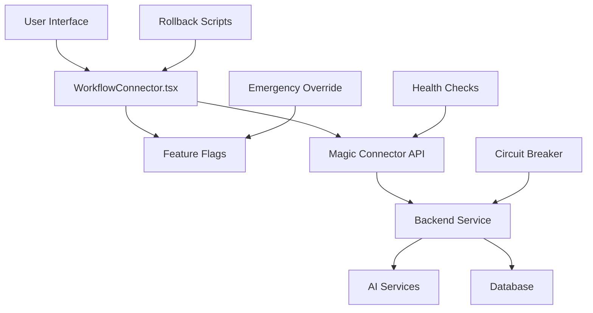

# Magic Connector Brownfield Safety Guide

**Version:** 1.0.0  
**Last Updated:** $(date +'%Y-%m-%d')  
**Author:** DevOps Safety Specialist  
**Purpose:** Comprehensive safety framework for Magic Connector deployment in brownfield environment

## 🚨 Critical Safety Overview

The Magic Connector represents sophisticated AI-powered functionality being integrated into an existing, mature codebase. This guide provides comprehensive risk mitigation strategies to ensure safe deployment while preserving existing system integrity.

### Quick Safety Reference

| Risk Level | Component | Mitigation Status | Emergency Contact |
|------------|-----------|------------------|-------------------|
| 🔴 **HIGH** | AI Analysis Pipeline | ✅ Feature Flags + Fallbacks | PO Sarah |
| 🟡 **MEDIUM** | Frontend Integration | ✅ Rollback Scripts | Frontend Team |
| 🟡 **MEDIUM** | Backend Service | ✅ Circuit Breakers | Backend Team |
| 🟢 **LOW** | Feature Flags | ✅ Emergency Override | DevOps Team |

## 📋 Integration Risk Assessment

### 1. Architecture Integration Points



### 2. Risk Categories & Mitigation

#### 🔴 HIGH RISK: AI Service Dependencies
**Risk:** AI service failures could break core user workflows
**Mitigation:**
- ✅ Comprehensive fallback workflows when AI fails
- ✅ Feature flag `magic_connector_fallback_workflows` (always enabled)
- ✅ Circuit breaker patterns in backend service
- ✅ Graceful degradation to manual workflow selection

#### 🟡 MEDIUM RISK: Frontend Integration
**Risk:** UI changes could affect existing user experience
**Mitigation:**
- ✅ Feature flag `magic_connector_enabled` for master control
- ✅ Non-intrusive UI integration (overlay, not replacement)
- ✅ Rollback script for instant frontend restoration
- ✅ Staged deployment with user acceptance testing

#### 🟡 MEDIUM RISK: Backend Service Load
**Risk:** New AI endpoints could impact existing backend performance
**Mitigation:**
- ✅ Caching layer with intelligent invalidation
- ✅ Request throttling and timeout controls
- ✅ Performance monitoring and alerting
- ✅ Database connection pooling optimization

#### 🟢 LOW RISK: Configuration Management
**Risk:** Feature flag misconfigurations
**Mitigation:**
- ✅ Default-safe configurations
- ✅ Emergency override capabilities
- ✅ Audit logging for all flag changes
- ✅ Environment-specific flag validation

## 🛡️ Safety Mechanisms

### 1. Feature Flag System

#### Master Control Flags
```typescript
// Essential flags that control core functionality
magic_connector_enabled: boolean          // Master switch
magic_connector_fallback_workflows: true  // Always enabled for safety
magic_connector_emergency_mode: boolean   // Emergency override
```

#### Progressive Enhancement Flags
```typescript
// Features that enhance but don't break core functionality
magic_connector_ai_analysis: boolean           // AI-powered analysis
magic_connector_cache_optimization: boolean    // Performance caching
magic_connector_ultra_fast_mode: boolean      // Speed optimizations
magic_connector_industry_insights: boolean     // Business intelligence
```

#### Emergency Controls
```typescript
// Emergency override capabilities
emergency_mode: boolean                // Disable all non-essential features
disable_all_ai: boolean               // Force fallback mode
force_fallback_mode: boolean          // Use safe implementations only
disable_new_features: boolean         // Stable features only
```

### 2. Rollback Procedures

#### Automatic Rollback Triggers
- Frontend build failures
- Backend health check failures  
- Error rate > 1%
- Response time > 5 seconds
- Memory usage > 80%
- CPU usage > 70%

#### Manual Rollback Commands
```bash
# Quick rollback to previous commit
./scripts/rollback-magic-connector.sh --confirm

# Partial rollback of specific component
./scripts/rollback-magic-connector.sh --partial WorkflowConnector

# Emergency restore from backup
./scripts/rollback-magic-connector.sh --emergency-restore backup-name

# Dry run to preview changes
./scripts/rollback-magic-connector.sh --dry-run HEAD~1
```

### 3. Deployment Safety Protocol

#### Stage 1: Validation (Required)
- ✅ Code compilation checks
- ✅ Lint and type checking
- ✅ Unit test execution
- ✅ Integration test validation
- ✅ Security scan completion
- ✅ Performance benchmark baseline

#### Stage 2: Development (Safe Testing)
- ✅ Local environment deployment
- ✅ Feature flag validation
- ✅ Manual functionality testing
- ✅ Performance profiling
- ✅ Memory leak detection
- ✅ Error handling verification

#### Stage 3: Staging (Pre-Production)
- ✅ Production-like environment
- ✅ Full E2E test suite
- ✅ Load testing execution
- ✅ Security penetration testing
- ✅ Cross-browser compatibility
- ✅ Mobile responsiveness check

#### Stage 4: Production (Monitored Release)
- ✅ Feature flag gradual rollout
- ✅ Real-time monitoring active
- ✅ Error tracking configured
- ✅ Performance metrics collection
- ✅ User feedback channels open
- ✅ Rollback procedures ready

## 🔥 Emergency Procedures

### Emergency Contacts
- **Primary:** PO Sarah (Magic Connector Product Owner)
- **Technical:** AI Engineer Team Lead
- **Infrastructure:** DevOps Team
- **Escalation:** CTO

### Emergency Scenarios & Responses

#### Scenario 1: AI Service Complete Failure
```bash
# Immediate Response (< 2 minutes)
curl -X POST localhost:3000/api/v1/feature-flags \
  -H "Content-Type: application/json" \
  -d '{"action": "disable_all_ai", "emergency": true}'

# Force fallback workflows
curl -X POST localhost:3000/api/v1/feature-flags \
  -H "Content-Type: application/json" \
  -d '{"action": "force_fallback_mode", "emergency": true}'
```

#### Scenario 2: Frontend Performance Degradation
```bash
# Enable ultra-fast mode only
curl -X POST localhost:3000/api/v1/feature-flags \
  -H "Content-Type: application/json" \
  -d '{"action": "update_flag", "flag": "magic_connector_ultra_fast_mode", "value": true}'

# Disable heavy features
curl -X POST localhost:3000/api/v1/feature-flags \
  -H "Content-Type: application/json" \
  -d '{"action": "disable_new_features", "emergency": true}'
```

#### Scenario 3: Critical Frontend Bug
```bash
# Complete rollback
./scripts/rollback-magic-connector.sh --confirm --partial WorkflowConnector

# Emergency mode
curl -X POST localhost:3000/api/v1/feature-flags \
  -H "Content-Type: application/json" \
  -d '{"action": "enable_emergency_mode", "emergency": true}'
```

#### Scenario 4: Database Impact
```bash
# Disable caching to reduce load
curl -X POST localhost:3000/api/v1/feature-flags \
  -H "Content-Type: application/json" \
  -d '{"action": "update_flag", "flag": "magic_connector_cache_optimization", "value": false}'

# Complete feature disable
curl -X POST localhost:3000/api/v1/feature-flags \
  -H "Content-Type: application/json" \
  -d '{"action": "update_flag", "flag": "magic_connector_enabled", "value": false}'
```

## 📊 Monitoring & Alerting

### Critical Metrics
- **Error Rate:** < 1% (Alert at 0.5%)
- **Response Time:** < 2s average (Alert at 3s)
- **Memory Usage:** < 80% (Alert at 70%)
- **CPU Usage:** < 70% (Alert at 60%)
- **Cache Hit Rate:** > 80% (Alert at 60%)

### Monitoring Endpoints
- Health Check: `GET /api/health`
- Feature Flags: `GET /api/v1/feature-flags`
- Magic Connector: `POST /api/v1/magic-connector/analyze-component`
- Metrics: `GET /api/metrics` (if available)

### Alert Escalation
1. **Level 1 (0-5 min):** Automated recovery attempt
2. **Level 2 (5-15 min):** DevOps team notification
3. **Level 3 (15-30 min):** Engineering team escalation
4. **Level 4 (30+ min):** Management escalation

## 🧪 Testing Strategies

### Pre-Deployment Testing

#### Unit Tests
```bash
cd web-builder
npm run test -- --coverage --watchAll=false
```

#### Integration Tests
```bash
cd web-builder
npm run test:integration
```

#### E2E Tests
```bash
cd web-builder
npx playwright test tests/e2e/magic-moment.spec.ts
```

#### Load Tests
```bash
# Artillery load testing
cd web-builder
npx artillery run tests/load/magic-connector-load.yml
```

### Post-Deployment Validation

#### Smoke Tests
```bash
# Basic functionality verification
./scripts/deploy-magic-connector-safely.sh validation
```

#### Performance Regression Tests
```bash
# Benchmark comparison
cd web-builder
npm run benchmark:magic-connector
```

#### User Acceptance Tests
- Magic Moment flow completion < 30 seconds
- AI suggestions quality score > 80%
- Fallback workflow availability 100%
- Cross-browser compatibility verification

## 📈 Performance Baselines

### Response Time Targets
- **AI Analysis:** < 5 seconds (target: 3 seconds)
- **Workflow Suggestions:** < 2 seconds (target: 1 second)
- **Ultra-Fast Mode:** < 1 second (guaranteed)
- **Fallback Mode:** < 500ms (guaranteed)

### Throughput Targets
- **Concurrent Users:** 1000 (target: 5000)
- **Requests per Second:** 100 (target: 500)
- **Cache Hit Rate:** 80% (target: 95%)
- **Error Rate:** < 0.1% (target: < 0.01%)

## 🔍 Troubleshooting Guide

### Common Issues & Solutions

#### Issue: AI Analysis Timeout
**Symptoms:** Requests timeout after 10 seconds
**Solution:**
```typescript
// Check feature flags
const flags = useFeatureFlags();
if (!flags.hasAIAnalysis) {
  // AI is disabled, using fallbacks
}

// Enable ultra-fast mode
setFeatureFlag('magic_connector_ultra_fast_mode', true);
```

#### Issue: High Memory Usage
**Symptoms:** Memory usage > 80%
**Solution:**
```bash
# Disable caching temporarily
curl -X POST localhost:3000/api/v1/feature-flags \
  -d '{"action": "update_flag", "flag": "magic_connector_cache_optimization", "value": false}'

# Clear existing caches
curl -X POST localhost:3000/api/v1/cache/clear
```

#### Issue: Frontend Build Failures
**Symptoms:** TypeScript compilation errors
**Solution:**
```bash
# Rollback to working state
./scripts/rollback-magic-connector.sh --confirm HEAD~1

# Check type definitions
cd web-builder
npm run type-check
```

#### Issue: Backend Service Errors
**Symptoms:** 500 errors from Magic Connector API
**Solution:**
```bash
# Enable emergency mode
curl -X POST localhost:3000/api/v1/feature-flags \
  -d '{"action": "enable_emergency_mode", "emergency": true}'

# Check backend logs
tail -f backend/logs/magic-connector.log
```

## 📚 Reference Documentation

### File Locations
- **Rollback Script:** `scripts/rollback-magic-connector.sh`
- **Deployment Script:** `scripts/deploy-magic-connector-safely.sh`
- **Feature Flags:** `web-builder/src/lib/feature-flags.ts`
- **API Routes:** `web-builder/src/app/api/v1/magic-connector/`
- **Backend Service:** `backend/app/services/magic_connector_service.py`

### Configuration Files
- **Frontend Config:** `web-builder/next.config.js`
- **Backend Config:** `backend/app/core/config.py`
- **Environment Variables:** `.env.local` (frontend), `.env` (backend)
- **Feature Flags API:** `web-builder/src/app/api/v1/feature-flags/route.ts`

### Backup Locations
- **Rollback Backups:** `.rollback-backups/`
- **Deployment Checkpoints:** `.checkpoints/`
- **Log Files:** `*-magic-connector-*.log`

## ✅ Pre-Deployment Checklist

### Development Team
- [ ] All unit tests passing
- [ ] Integration tests verified
- [ ] E2E tests successful
- [ ] TypeScript compilation clean
- [ ] Linting issues resolved
- [ ] Performance benchmarks within targets

### DevOps Team
- [ ] Feature flags configured correctly
- [ ] Rollback procedures tested
- [ ] Monitoring alerts configured
- [ ] Emergency procedures documented
- [ ] Backup strategies validated
- [ ] Deployment scripts tested

### Product Team
- [ ] User acceptance criteria met
- [ ] Magic Moment flow validated
- [ ] Fallback workflows tested
- [ ] Performance targets achieved
- [ ] Error handling verified
- [ ] Documentation updated

### Infrastructure Team
- [ ] Server capacity verified
- [ ] Database performance tested
- [ ] Network latency optimized
- [ ] CDN configuration updated
- [ ] SSL certificates valid
- [ ] Security scans passed

---

## 🚀 Deployment Authorization

**Required Approvals:**
- [ ] Technical Lead (Architecture Review)
- [ ] Product Owner Sarah (Business Logic Review)
- [ ] DevOps Lead (Safety Review)
- [ ] QA Lead (Testing Review)

**Final Safety Confirmation:**
- [ ] All rollback procedures tested and verified
- [ ] All feature flags configured for safe deployment
- [ ] All emergency contacts notified and available
- [ ] All monitoring systems active and verified

**Deployment Approved By:** _________________ **Date:** _________

---

> **Remember:** When in doubt, prioritize system stability over feature deployment. The brownfield environment requires conservative approaches to maintain existing user trust and system reliability.