# BMad Development Protocol - Complete Workflow Management

## 🚨 CRITICAL: GitHub MCP Usage Rule

**NEVER USE GITHUB API DIRECTLY - ALWAYS USE GITHUB MCP TOOLS**

```bash
# ❌ WRONG - Will always fail with 401 errors
GET https://api.github.com/repos/...

# ✅ CORRECT - Use GitHub MCP tools exclusively
mcp__github__get_pull_request(owner="gpb360", repo="AI-Marketing-Web-Builder", pullNumber=132)
mcp__github__list_pull_requests(owner="gpb360", repo="AI-Marketing-Web-Builder")
mcp__github__create_pull_request(...)
```

**This rule is MANDATORY and applies 100% of the time. No exceptions.**

## 🎯 Pre-Work Protocol - Branch Management First

### RULE: Before Any Work Starts

**MANDATORY SEQUENCE - Execute in this exact order:**

1. **Check Current Branch Status**
   ```bash
   git status                    # Verify current branch
   git log --oneline -5         # See recent commits
   ```

2. **Process Review Column Tasks**
   - Get all tasks in "Review" status from Archon
   - **REQUIREMENT**: Every Review task MUST have a corresponding PR
   - If Review task has no PR → Create PR immediately
   - If Review task has PR → Process the PR review

3. **Process Existing PRs** 
   ```bash
   # Use GitHub MCP tools ONLY
   mcp__github__list_pull_requests(owner="gpb360", repo="AI-Marketing-Web-Builder", state="open")
   ```

4. **Create New Branch from Main**
   ```bash
   git checkout main
   git pull origin main
   git checkout -b feature/task-{archon-id}-{description}
   git push -u origin feature/task-{archon-id}-{description}
   ```

5. **Only Then Begin New Task Work**

## 📋 Review-to-PR Mapping Requirements

### Mandatory PR Creation Rules

**ABSOLUTE REQUIREMENT**: No task can be in "Review" status without a corresponding PR.

```bash
# When moving task to "Review" status:
archon:manage_task(
  action="update",
  task_id="task-123",
  update_fields={
    "status": "review",
    "pr_url": "https://github.com/gpb360/AI-Marketing-Web-Builder/pull/133"
  }
)
```

### PR Creation Process
1. **Create Feature Branch** (if not exists)
2. **Push All Changes**
3. **Create PR via GitHub MCP**:
   ```bash
   mcp__github__create_pull_request(
     owner="gpb360",
     repo="AI-Marketing-Web-Builder", 
     title="[TASK-ID] Feature Description",
     head="feature/task-{id}-{desc}",
     base="main",
     body="Completes Archon task {task-id}\n\n{detailed description}"
   )
   ```
4. **Update Archon Task** with PR URL
5. **Set Status to Review**

## 🔍 PR Review Categorization System

### Mandatory Review Categories

Every PR review MUST categorize ALL findings into these buckets:

#### 1. **Nice to Have Future Development**
- **Action**: Document in backlog for future sprints
- **Examples**: Performance optimizations, UX enhancements, additional features
- **Decision**: Approve PR, create future tasks

#### 2. **Must Haves Future Add-ons**  
- **Action**: Create high-priority Archon tasks immediately
- **Examples**: Security improvements, scalability requirements, critical missing features
- **Decision**: Approve PR, schedule high-priority follow-up

#### 3. **Current Blocker Fix Now**
- **Action**: DO NOT MERGE - Fix in current branch immediately
- **Examples**: Build failures, test failures, critical bugs, security vulnerabilities
- **Decision**: Request changes, block merge until fixed

#### 4. **Not Needed Move On**
- **Action**: Document reasoning and proceed with merge
- **Examples**: Over-engineering suggestions, out-of-scope improvements
- **Decision**: Approve PR, document why suggestions were declined

#### 5. **Should Be Refactored - Technical Debt**
- **Action**: Approve merge but create refactoring task
- **Examples**: Code duplication, complex functions, missing abstractions
- **Decision**: Merge now, add to technical debt backlog

### Review Documentation Template

```markdown
## PR Review Categorization

### Nice to Have Future Development
- [ ] Performance optimization for large datasets
- [ ] Add keyboard shortcuts for power users

### Must Haves Future Add-ons
- [ ] Input validation for user-generated content
- [ ] Error boundary implementation

### Current Blocker Fix Now
- [ ] ❌ Build failing due to TypeScript errors
- [ ] ❌ Tests not passing in CI

### Not Needed Move On
- [ ] Suggested design patterns don't fit current architecture
- [ ] Over-optimization for edge cases

### Should Be Refactored - Technical Debt
- [ ] Extract common utility functions
- [ ] Simplify complex conditional logic

**Decision**: [Approve/Request Changes/Needs Work]
**Reasoning**: [Detailed explanation]
```

## 🔒 Main Branch Protection Protocol

### Absolute Requirements

**Main branch MUST remain error-free and deployable at all times.**

#### Pre-Merge Verification
1. **All CI checks pass** (build, test, lint)
2. **Manual functionality test** completed
3. **No merge conflicts** with main
4. **Review categorization** completed
5. **All blockers resolved**

#### Post-Merge Verification
```bash
# Immediately after merge - verify main is healthy
git checkout main
git pull origin main
npm run build                # Frontend must build
cd backend && make dev      # Backend must start
npm run test:critical       # Critical tests must pass
```

#### Rollback Protocol
If main becomes broken:
1. **STOP all development** on feature branches
2. **Identify breaking commit**: `git log --oneline`
3. **Create emergency hotfix** from last good commit
4. **Implement minimal fix**
5. **Emergency merge** after testing
6. **All agents rebase** feature branches on fixed main

## 🔄 Parallel Agent Coordination

### Conflict Prevention Rules

1. **Claim Tasks Early**: Update Archon task to "doing" status immediately
2. **Separate Branches**: Each agent works on own feature branch
3. **Coordinate on Shared Files**: Use Archon task comments for communication
4. **Merge Priority**: Highest `task_order` gets merge priority

### Parallel Work Process

```bash
# Agent 1 working on task-abc
git checkout -b feature/task-abc-auth-system

# Agent 2 working on task-def  
git checkout -b feature/task-def-payment-flow

# Both can work simultaneously without conflicts
# Merge coordination happens at PR level
```

### Merge Coordination
1. **Higher priority task merges first** (task_order)
2. **Other agents rebase** their branches on updated main
3. **Resolve conflicts** in feature branches before new PR
4. **Full test suite** runs after each merge to main

## 🎭 Enhanced BMad Development Phases (From PR #132)

### Phase-Based Quality Gates
Based on `bmad-testing-config.json` enhancements:

```
📝 Story Created → 🔧 In Development → ✅ QA Testing → 🎭 E2E Validation → 🚀 Deployed → 🎯 Complete
```

#### Phase 1: 📝 Story Created
- **Requirements**: Story documented, acceptance criteria defined
- **Testing**: None required
- **Playwright MCP**: Not needed

#### Phase 2: 🔧 In Development  
- **Requirements**: Unit tests written, code implementation
- **Testing**: Unit tests
- **Playwright MCP**: Not needed

#### Phase 3: ✅ QA Testing
- **Requirements**: Integration tests pass, component testing complete
- **Testing**: Unit, integration, component tests
- **Playwright MCP**: Optional for component testing

#### Phase 4: 🎭 E2E Validation (NEW - Playwright MCP Required)
- **Requirements**: 
  - Playwright E2E tests pass
  - Magic Moment validation (<30 minutes template-to-live-site)
  - Cross-browser testing (Chrome, Firefox, Safari)
  - Performance benchmarks met
- **Testing**: Unit, integration, E2E, performance, cross-browser
- **Playwright MCP**: **MANDATORY** - Use `mcp__playwright__*` tools
- **Quality Targets**:
  - Magic Moment completion: < 30 minutes
  - AI component analysis: < 5 seconds
  - Template loading: < 3 seconds
  - Workflow success rate: > 90%
  - Cross-browser compatibility: 100%

#### Phase 5: 🚀 Deployed
- **Requirements**: Production deployment complete, smoke tests pass
- **Testing**: Smoke tests, monitoring
- **Playwright MCP**: Optional for smoke testing

#### Phase 6: 🎯 Complete
- **Requirements**: Final validation complete, business sign-off
- **Testing**: None required
- **Playwright MCP**: Not needed

## 🎭 Playwright MCP Integration Requirements

### Mandatory E2E Validation Tools
**CRITICAL: Use Playwright MCP tools exclusively for browser automation**

```bash
# Navigation and page management
mcp__playwright__browser_navigate(url="http://localhost:3003")
mcp__playwright__browser_snapshot()  # Better than screenshots for actions
mcp__playwright__browser_take_screenshot(fullPage=true)

# User interactions
mcp__playwright__browser_click(element="Build My Website button", ref="button-123")
mcp__playwright__browser_type(element="Project name input", ref="input-456", text="Test Site")
mcp__playwright__browser_select_option(element="Template dropdown", ref="select-789", values=["saas-pro"])

# Validation and testing
mcp__playwright__browser_wait_for(text="Site published successfully", time=30)
mcp__playwright__browser_evaluate(function="() => document.title")
```

### E2E Test Categories (All Required for Phase 4)

#### 1. Magic Moment Validation
- **Test**: Complete template-to-live-site journey in <30 minutes
- **Tools**: Full Playwright MCP workflow
- **Success Criteria**: User can select template, customize, publish, and access live site
- **Performance**: Track timing at each step

#### 2. Cross-Browser Testing  
- **Browsers**: Chrome, Firefox, Safari (webkit)
- **Tools**: `mcp__playwright__browser_*` across all browsers
- **Success Criteria**: 100% compatibility across all browsers
- **Focus**: UI consistency, functionality, performance

#### 3. Component Intelligence Testing
- **Test**: AI suggestions appear within 5 seconds of component placement
- **Tools**: Playwright MCP for component interactions
- **Success Criteria**: AI customization responds in <5 seconds
- **Validation**: Workflow suggestions are relevant and actionable

#### 4. Performance Benchmarking
- **Test**: Template loading and builder performance
- **Tools**: Playwright MCP with performance measurement
- **Success Criteria**: 
  - Template loading: <3 seconds
  - Drag-drop interactions: <100ms response
  - Canvas with 100+ components: No degradation

### E2E Validation Workflow

```bash
# 1. Start E2E validation phase
mcp__playwright__browser_navigate(url="http://localhost:3003")
mcp__playwright__browser_snapshot()  # Capture initial state

# 2. Magic Moment test
mcp__playwright__browser_click(element="Templates link", ref="nav-templates")
mcp__playwright__browser_wait_for(text="Premium Templates")
mcp__playwright__browser_click(element="SaaS Pro template", ref="template-saas-pro")

# 3. Builder functionality test  
mcp__playwright__browser_wait_for(text="Drag components here")
mcp__playwright__browser_click(element="Contact Form component", ref="component-contact")
# ... drag and drop testing

# 4. AI customization test
mcp__playwright__browser_wait_for(text="AI Suggestions", time=5)
mcp__playwright__browser_click(element="Apply AI suggestion", ref="ai-suggestion-1")

# 5. Publishing test
mcp__playwright__browser_click(element="Publish Site", ref="publish-button")
mcp__playwright__browser_wait_for(text="Site published successfully", time=30)

# 6. Cross-browser validation
# Repeat above tests in Firefox and Safari
```

## 📊 Process Flow Summary

```mermaid
graph TD
    A[Start Development] --> B{Check Current Branch}
    B --> C[Process Review Tasks]
    C --> D{Review Tasks Have PRs?}
    D -->|No| E[Create PRs for Review Tasks]
    D -->|Yes| F[Review Existing PRs]
    E --> F
    F --> G[Categorize PR Findings]
    G --> H{Any Blockers?}
    H -->|Yes| I[Fix Blockers in Branch]
    H -->|No| J[Merge Approved PRs]
    I --> G
    J --> K[Verify Main Branch Health]
    K --> L[Create New Feature Branch]
    L --> M[Begin New Task Work]
    M --> N[Complete Feature]
    N --> O[Create PR]
    O --> P[Update Archon to Review]
    P --> Q{Ready for E2E?}
    Q -->|Yes| R[🎭 Playwright E2E Validation]
    Q -->|No| C
    R --> S{E2E Tests Pass?}
    S -->|No| I
    S -->|Yes| T[Deploy & Complete]
    T --> C
```



## 🛠 Implementation Checklist

### Daily Development Start
- [ ] Check current git branch and status
- [ ] Review Archon tasks in "review" status
- [ ] Verify all review tasks have corresponding PRs
- [ ] Process existing PRs using categorization system
- [ ] Merge approved PRs and verify main health
- [ ] Create new feature branch from clean main
- [ ] Begin new task work

### PR Creation Checklist
- [ ] All changes committed and pushed
- [ ] PR created using GitHub MCP tools
- [ ] PR title follows format: `[TASK-ID] Description`
- [ ] PR description includes Archon task reference
- [ ] Archon task updated with PR URL
- [ ] Archon task status set to "review"

### PR Review Checklist  
- [ ] All findings categorized into 5 buckets
- [ ] Blockers identified and documented
- [ ] Future tasks created for "must haves"
- [ ] Technical debt tasks created for refactoring needs
- [ ] Clear decision documented (approve/reject/needs work)
- [ ] Reasoning provided for all decisions

### Merge Process Checklist
- [ ] All automated checks passing
- [ ] Review categorization complete
- [ ] No blocking issues remaining
- [ ] Branch up to date with main
- [ ] Post-merge verification plan ready
- [ ] Rollback plan documented if needed

## 🚨 Emergency Procedures

### Broken Main Recovery
1. **Immediate halt** of all feature development
2. **Emergency hotfix branch** from last known good commit
3. **Minimal fix implementation**
4. **Emergency merge** after verification
5. **All feature branches rebase** on fixed main
6. **Post-mortem** to prevent recurrence

### Conflicting Parallel Work
1. **Identify merge priority** by Archon task_order
2. **Higher priority merges first**
3. **Other agents rebase** on updated main
4. **Resolve conflicts** in feature branches
5. **Create new PRs** if significant conflicts
6. **Coordinate through Archon** task comments

---

**This protocol ensures stable main branch, proper review processes, and effective parallel development while maintaining high quality and velocity.**